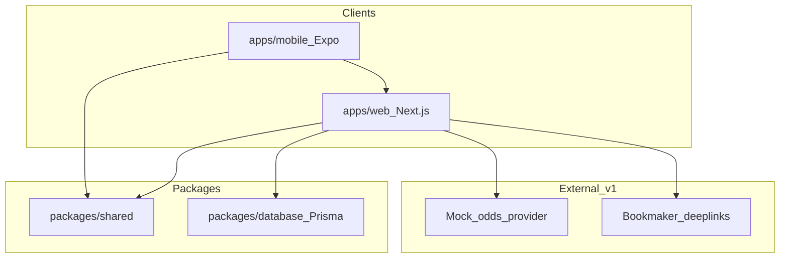

# The Syndicate — Architecture

## Overview

Monorepo with API-first design. Web MVP ships first; iPhone app (Expo) consumes the same REST API.



## Stack

| Layer | Choice | Rationale |
|-------|--------|-----------|
| Web | Next.js 15 (App Router) + TypeScript + Tailwind | Fast iteration, SEO, API routes co-located |
| Mobile | Expo (React Native) + TypeScript | Shared TS types, fast iOS scaffold |
| API | Next.js Route Handlers (`/api/*`) | Single deploy unit for MVP |
| Database | SQLite (dev) via Prisma; Postgres-ready schema | Zero-config local dev |
| Auth | Auth.js v5 (NextAuth) credentials provider | Simple email/password for v1 |
| Validation | Zod in `packages/shared` | Shared between web, API, mobile |
| Monorepo | npm workspaces | Lightweight, no extra tooling required |

## Repo layout

```
the-syndicate/
  apps/
    web/                 # Next.js app + API routes
    mobile/              # Expo iOS client
  packages/
    shared/              # Zod schemas, types, constants
    database/            # Prisma schema + client
  docs/
  AGENTS.md
  .cursor/rules/
```

## Data model (core entities)

- **User** — account, aggregate stats (total points, legs won/lost)
- **Group** — name, invite code, owner, settings, status
- **GroupMember** — user ↔ group, role (owner/member), points in group
- **Round** — one group acca cycle (collecting → locked → settled)
- **Leg** — member's selection: fixture, market, selection, odds, bookmaker, outcome
- **Fixture** — cached from odds provider (home, away, kickoff, competition)

## Odds and bookmakers (v1)

- `lib/odds/provider.ts` — mock football fixtures and multi-bookmaker prices
- Structured for swap-in of [The Odds API](https://the-odds-api.com/) or similar
- `lib/odds/betslip-links.ts` — generates bookmaker-specific deeplink URLs

## Settlement logic

- Leg outcomes set manually via admin seed / demo "settle" action for v1
- Production: integrate results API or manual admin override
- Points: +3 win, +1 void, 0 loss (configurable in shared constants)
- Group P&L: theoretical £10 stake × combined decimal odds if all legs win, else -stake

## Auth flow

- Credentials provider with bcrypt-hashed passwords
- JWT session strategy
- API routes check session via `auth()` helper

## Deployment (target)

- **Web + API:** Vercel
- **Database:** Neon Postgres (swap `DATABASE_URL` from SQLite)
- **Mobile:** EAS Build → TestFlight

## iPhone approach

**Expo** — reuses `packages/shared` types and calls `apps/web` API over HTTPS. Native enhancements (push, share sheet) added post-MVP.
