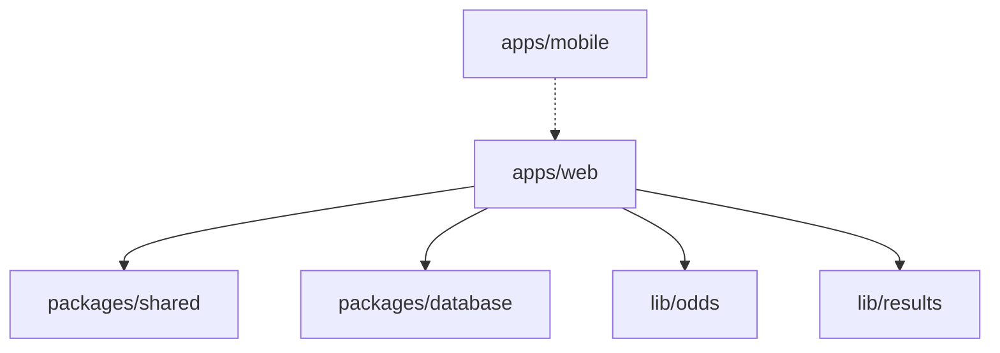

# The Syndicate — Architecture

**As-built detail:** [CURRENT_STATE.md](./CURRENT_STATE.md) · **Index:** [README.md](./README.md)

---

## Overview

Monorepo, API-first. Web is production; mobile consumes same REST API (paused).

---

## Stack

| Layer | Choice |
|-------|--------|
| Web | Next.js 15 App Router, TypeScript, Tailwind v4 |
| API | Next.js Route Handlers `/api/*` |
| DB | PostgreSQL, Prisma |
| Auth | Auth.js v5 credentials, JWT sessions |
| Validation | Zod in `packages/shared` |
| Deploy | Cloud Run, Cloud SQL, GitHub Actions |
| IaC | Terraform `infra/terraform/` |

---

## Data model

| Entity | Purpose |
|--------|---------|
| **User** | Account; aggregate points |
| **Group** | Name, invite code, owner, status |
| **GroupMember** | Membership, role, group-scoped points |
| **Round** | Acca cycle: collecting → locked → settled |
| **Leg** | One pick per member: fixture, market, odds, outcome |

Planned: **Match** (shared results), **Leg.competitionId** — [specs/competitions-and-results.md](./specs/competitions-and-results.md)

Schema: `packages/database/prisma/schema.prisma`

---

## Subsystems

### Odds
Live ([The Odds API](https://the-odds-api.com/)) or mock. Bulk + lazy per-event markets. Retail bookmaker filter. Acca pricing at lock.

→ File map in [CURRENT_STATE.md](./CURRENT_STATE.md#odds-flow)

### Settlement
Manual owner settle or auto via football-data.org. Market resolution in `resolve-leg.ts`.

Planned: shared `Match` ingest — [specs/competitions-and-results.md](./specs/competitions-and-results.md)

### Scoring
**Today:** flat +3 / +1 / 0 per leg; £10 acca P/L on round.

**Planned:** unit-stake points — [specs/group-stats-and-points.md](./specs/group-stats-and-points.md)

### Auth
Credentials + bcrypt. Session on web; Bearer JWT for mobile (`/api/auth/mobile/sign-in`).

---

## Deployment

GCP: Cloud Run + Cloud SQL + Secret Manager. See [DEPLOYMENT.md](./DEPLOYMENT.md).

Production URL via Cloudflare → Cloud Run (region `europe-west2`).

---

## Mobile

Expo app in `apps/mobile/` — **paused**. Resume after web loop validated.
