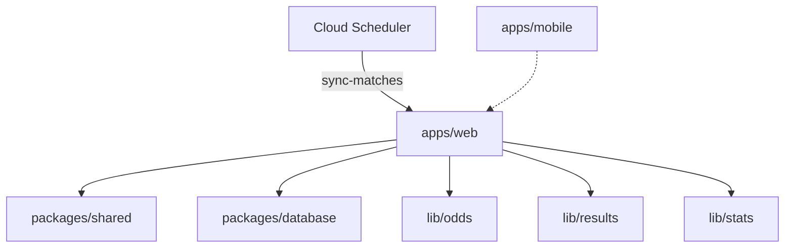

# The Syndicate — Architecture

**As-built detail:** [CURRENT_STATE.md](./CURRENT_STATE.md) · **Index:** [README.md](./README.md)

---

## Overview

Monorepo, API-first. Web is production; mobile consumes same REST API (**paused**).

---

## Stack

| Layer | Choice |
|-------|--------|
| Web | Next.js 15 App Router, TypeScript, Tailwind v4, Recharts |
| API | Next.js Route Handlers `/api/*` |
| DB | PostgreSQL, Prisma |
| Auth | Auth.js v5 credentials, JWT sessions |
| Validation | Zod in `packages/shared` |
| Deploy | Cloud Run, Cloud SQL, GitHub Actions |
| IaC | Terraform `infra/terraform/` |

---

## Data model

| Entity | Purpose |
|--------|---------|
| **User** | Account; `role` (`user` \| `admin`); aggregate `totalPoints` |
| **Group** | Name, invite code, owner, status |
| **GroupMember** | Membership, group role (`owner` \| `member`), group-scoped points |
| **Round** | Acca cycle: collecting → locked → settled; `accaBookmakerRankings` JSON at lock |
| **Leg** | One pick per member: fixture, `competitionId`, market, odds, outcome |
| **Match** | Canonical fixture result (football-data.org sync); reused for auto-settle |
| **AnalyticsEvent** | Product analytics: `sign_up`, `login`, `page_view` |

Schema: `packages/database/prisma/schema.prisma`

---

## Subsystems

### Odds
Live ([The Odds API](https://the-odds-api.com/)) or mock. Fixtures fetched **per competition** slug. Bulk + lazy per-event markets. Retail bookmaker filter. At lock: `rankAccaBookmakers()` stores ranked list on `Round`.

→ [CURRENT_STATE.md](./CURRENT_STATE.md#odds--competitions-today)

### Settlement
Manual owner settle, owner-triggered auto-settle, or **hands-off** after hourly match sync. Market resolution in `resolve-leg.ts`. Email notifications on lock/settle (Resend, optional).

→ [CURRENT_STATE.md](./CURRENT_STATE.md#settlement)

### Scoring
**Unit-stake points:** win `odds−1`, loss `−1`, void `0`. **Points are the primary user-facing metric.** Profit equivalent: `points × stake` via `profitFromPoints()`. `Round.profitLossGbp` retained for admin/settlement.

→ `packages/shared/src/scoring.ts` · [specs/platform-admin.md](./specs/platform-admin.md)

### Stats
Computed on read from settled rounds. Group + member + **cross-group user** APIs; Recharts on group Performance tab and `/performance` page. Share cards for copy/Web Share.

→ `apps/web/src/lib/stats/`

### Web UI layout
- **Header:** `AppNav` — Groups (`/dashboard`) ↔ Performance (`/performance`)
- **Group shell:** `groups/[id]/layout.tsx` + `GroupDataProvider` — shared fetch for sub-pages
- **Group tabs:** Round (`/groups/[id]`), Leaderboard, Performance
- **Locked round:** picks list → betslip CTA → collapsible bookmaker comparison

→ [CURRENT_STATE.md](./CURRENT_STATE.md#web-pages)

### Auth
Credentials + bcrypt. Session on web (includes `user.role`); Bearer JWT for mobile (`/api/auth/mobile/sign-in`).

### Platform admin
`ADMIN_EMAILS` env promotes users to `role: admin`. Admin pages at `/admin/*`; APIs at `/api/admin/*`. Lightweight `AnalyticsEvent` logging.

→ [specs/platform-admin.md](./specs/platform-admin.md)

### Marketing (public)
Homepage (`/`), about (`/about`). Turf Green tokens + Acca stack logo. Content in `lib/marketing-content.ts`.

→ [BRAND.md](./BRAND.md)

---

## Deployment

GCP: Cloud Run + Cloud SQL + Secret Manager. Match sync via Cloud Scheduler → `POST /api/internal/sync-matches`.

See [DEPLOYMENT.md](./DEPLOYMENT.md).

Production URL: **https://www.the-syndicate.uk** (Cloudflare → Cloud Run, `europe-west2`).

---

## Mobile

Expo app in `apps/mobile/` — **paused**. Needs competition picker API changes before resume.
