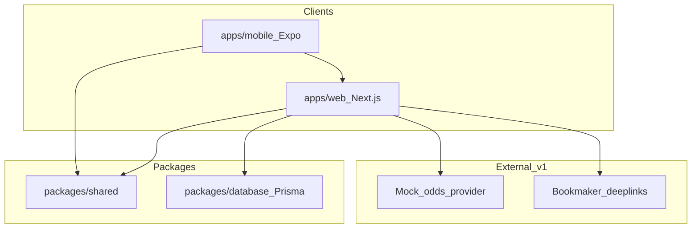

# The Syndicate — Architecture

## Overview

Monorepo with API-first design. Web MVP ships first; iPhone app (Expo) consumes the same REST API.



## Stack

| Layer | Choice | Rationale |
|-------|--------|-----------|
| Web | Next.js 15 (App Router) + TypeScript + Tailwind | Fast iteration, SEO, API routes co-located |
| Mobile | Expo (React Native) + TypeScript | Shared TS types, fast iOS scaffold |
| API | Next.js Route Handlers (`/api/*`) | Single deploy unit for MVP |
| Database | PostgreSQL via Prisma; local Docker Compose, Cloud SQL in production | Production-ready, GCP-native |
| Auth | Auth.js v5 (NextAuth) credentials provider | Simple email/password for v1 |
| Validation | Zod in `packages/shared` | Shared between web, API, mobile |
| Monorepo | npm workspaces | Lightweight, no extra tooling required |

## Repo layout

```
the-syndicate/
  apps/
    web/                 # Next.js app + API routes
    mobile/              # Expo iOS client
  packages/
    shared/              # Zod schemas, types, constants
    database/            # Prisma schema + client
  docs/
  AGENTS.md
  .cursor/rules/
```

## Data model (core entities)

- **User** — account, aggregate stats (total points, legs won/lost)
- **Group** — name, invite code, owner, settings, status
- **GroupMember** — user ↔ group, role (owner/member), points in group
- **Round** — one group acca cycle (collecting → locked → settled)
- **Leg** — member's selection: fixture, market, selection, odds, bookmaker, outcome
- **Fixture** — cached from odds provider (home, away, kickoff, competition)

## Odds and bookmakers

- `lib/odds/mock-provider.ts` — demo fixtures when no API key
- `lib/odds/the-odds-api.ts` — live odds from [The Odds API](https://the-odds-api.com/) (h2h, spreads, totals on bulk; btts/double chance/draw no bet per-event)
- `lib/odds/event-markets.ts` — lazy-loaded extended markets per fixture
- `lib/odds/bookmakers.ts` — retail bookmaker filter (excludes exchanges)
- `lib/odds/provider.ts` — selects live or mock; 10-minute in-memory cache
- Set `ODDS_API_KEY` for live odds; falls back to mock automatically
- `lib/odds/betslip-links.ts` — generates bookmaker-specific deeplink URLs

## Settlement logic

- **Manual:** group owner marks legs won/lost/void via `POST /api/rounds/[id]/settle`
- **Automatic (interim):** `POST /api/rounds/[id]/auto-settle` fetches finished matches from [football-data.org](https://www.football-data.org/), matches legs by team names + kickoff date, resolves each market type (`lib/results/resolve-leg.ts`), then applies points
- **Planned:** shared `Match` table + scheduled ingest per competition — see [COMPETITIONS_AND_RESULTS.md](./COMPETITIONS_AND_RESULTS.md)
- Set `FOOTBALL_DATA_API_KEY` in production for auto-settle; owner can still override manually
- Points: +3 win, +1 void, 0 loss (configurable in shared constants)
- Group P&L: theoretical £10 stake × combined decimal odds if all legs win, else -stake

## Auth flow

- Credentials provider with bcrypt-hashed passwords
- JWT session strategy
- API routes check session via `auth()` helper

## Deployment

**Target platform:** Google Cloud Platform

- **Web + API:** Cloud Run (Docker container, Next.js standalone)
- **Database:** Cloud SQL for PostgreSQL
- **CI/CD:** GitHub Actions on push to `main`
- **Infrastructure:** Terraform (`infra/terraform/`)
- **Secrets:** GCP Secret Manager
- **Mobile:** EAS Build → TestFlight (separate from web deploy)

See [DEPLOYMENT.md](./DEPLOYMENT.md) and [infra/terraform/README.md](../infra/terraform/README.md).

## iPhone approach

**Expo** — reuses `packages/shared` types and calls `apps/web` API over HTTPS. Native enhancements (push, share sheet) added post-MVP.
