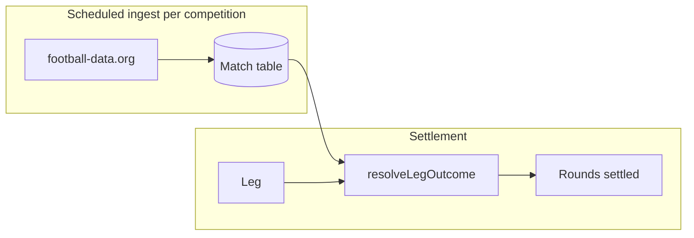

# Competitions & shared results — spec

Status: **spec only** for competitions + shared `Match` table. **Odds UX** (best per leg, acca bookmaker at lock) is implemented — see `lib/odds/acca.ts`, `lib/odds/lock-round.ts`.

## Goals

1. **Curated competitions** — offer odds for English football leagues and the FIFA World Cup only (expand later).
2. **Per-leg competition picker** — each member chooses their own competition before browsing fixtures (cross-competition accas are part of the fun).
3. **Shared match results** — one canonical result per real-world fixture, polled once per competition, reused by all groups and legs.

---

## Odds UX (implemented)

### Individual leg submission

- User sees **only the best retail odds** per selection — no bookmaker picker, no 3/5/10 list.
- Server stores best odds at submit time (`sortQuotesByBestOdds`).
- Bookmaker choice is **deferred** until the round locks.

### Group acca at lock

When all members have submitted:

1. Re-fetch all bookmaker quotes for each leg's selection.
2. Find bookmakers that quote **every** leg; pick the one with the highest **combined** decimal odds (`findBestAccaBookmaker`).
3. Update each leg's displayed odds to that bookmaker's prices (so leg odds × leg odds = combined).
4. Show **AccaSummary** with recommended bookmaker + combined odds + betslip link.

If no single bookmaker covers all legs (common with cross-competition accas), show combined best-per-leg odds and prompt to place legs individually.

---

## Phase 1 competitions

| Slug | Display name | The Odds API `sport_key` | football-data `code` |
|------|--------------|--------------------------|----------------------|
| `epl` | Premier League | `soccer_epl` | `PL` |
| `championship` | Championship | `soccer_efl_champ` | `ELC` |
| `league-one` | League One | `soccer_england_league1` | `EL1` |
| `league-two` | League Two | `soccer_england_league2` | `EL2` |
| `world-cup` | FIFA World Cup | `soccer_fifa_world_cup` | `WC` |

**Phase 1b:** FA Cup (`soccer_fa_cup` / `FAC`), EFL Cup.

Catalogue: `packages/shared/src/competitions.ts` (to be added).

---

## UX: competition before fixtures (per leg)

Each member picks **their own** competition when submitting a leg. One round can mix EPL, Championship, World Cup, etc.

```
Submit leg form
  1. Pick competition (EPL, Championship, World Cup, …)
  2. Pick fixture (filtered to that competition)
  3. Pick market → selection (best odds shown only)
  4. Submit
```

**Why per-leg:**

- Cross-competition accas are intentional product fun.
- Members can back different leagues in the same group round.
- Round history shows each leg's competition via existing `Leg.competition` field.

**Implementation notes:**

- `GET /api/fixtures?competition=epl` — fixtures for one competition.
- `Leg.competitionId` (slug) + `Leg.competition` (display name) at submit.
- Remove global `ODDS_API_SPORT` env as the default behaviour.
- Mock provider returns fixtures grouped by competition.

---

## Data model (planned)

### `Leg` — add competition slug

```prisma
model Leg {
  // existing fields…
  competitionId String  // slug: epl, world-cup, etc.
  competition   String  // display name (already exists)
}
```

No `competitionId` on `Round` — rounds are competition-agnostic.

### `Match` — shared fixture results

```prisma
model Match {
  id                 String    @id @default(cuid())
  competitionId      String
  kickoff            DateTime
  homeTeam           String
  awayTeam           String
  status             String    @default("SCHEDULED")
  homeGoals          Int?
  awayGoals          Int?
  externalOddsId     String?   @unique
  externalDataId     Int?      @unique
  lastSyncedAt       DateTime?
  createdAt          DateTime  @default(now())
  updatedAt          DateTime  @updatedAt

  @@index([competitionId, kickoff])
  @@index([status])
}
```

```prisma
model Leg {
  matchId String?  // FK → Match, linked at submit or ingest
}
```

---

## Results sync architecture



**Ingest:** poll `GET /v4/competitions/{code}/matches` per catalogue competition on a schedule (Cloud Scheduler).

**Settle:** read `Match` rows — no per-group API calls. Match legs via `matchId` or team + kickoff + `competitionId`.

**Cross-competition rounds:** each leg resolves against its own `Match` row regardless of competition.

---

## API changes (planned)

| Endpoint | Change |
|----------|--------|
| `GET /api/competitions` | Active catalogue + in-season flag |
| `GET /api/fixtures?competition=` | Fixtures for chosen competition |
| `POST /api/legs` | Body includes `competitionId`; best odds only (done) |
| Lock round | Acca bookmaker comparison (done) |
| `POST /api/internal/sync-matches` | Cron ingest → `Match` table |

---

## Implementation phases

### Phase A — Competition picker

- [ ] `packages/shared/src/competitions.ts`
- [ ] `GET /api/competitions`
- [ ] Competition step in `SubmitLegForm` (before fixtures)
- [ ] `GET /api/fixtures?competition=`
- [ ] `Leg.competitionId` migration + validation

### Phase B — Shared Match table + ingest

- [ ] `Match` model + sync job
- [ ] Auto-settle from DB

### Phase C — Hands-off settlement

- [ ] Post-ingest auto-settle eligible rounds
- [ ] Notifications

---

## Current state vs future

| Concern | Today | After full spec |
|---------|-------|-----------------|
| Leg odds UI | Best only | Same |
| Acca bookmaker | Compared at lock across all legs | Same |
| Competition scope | Single env sport (World Cup) | Per-leg picker |
| Match results | Fetched on auto-settle click | Shared `Match` table |

---

## Open questions

1. **Ship EPL + World Cup first** in picker, or all five leagues day one?
2. **Cross-comp betslip** — when no single bookmaker covers all legs, offer per-leg deeplinks?
3. **Ingest frequency** — hourly default; more often on match days?
