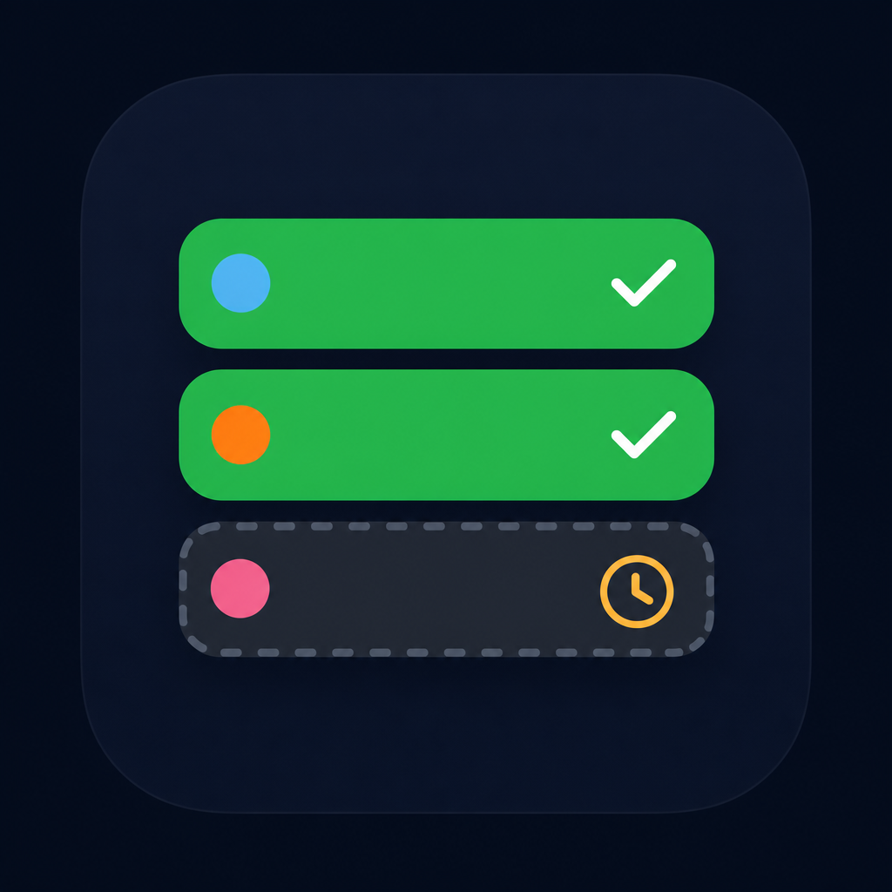

# Logo review — Betslip concepts (July 2026)

| Field | Value |
|-------|-------|
| **Status** | Draft for review — **not shipped** |
| **Scope** | Alternative logo marks exploring a betslip with 2 won legs + 1 pending, each leg picked by a different person |
| **Production logo** | Unchanged — Acca stack in `apps/web/src/components/logo.tsx` |
| **Assets** | `docs/brand/logo-review/concept-*.png` |

---

## Brief

Tiki Acca is a **social group acca** product: one leg per member, shared stake, leaderboard accountability. The current **Acca stack** mark (three green bars on a rounded square) reads as “building an acca” but does not show **outcomes** or **multiple people**.

These concepts explore a mark that communicates:

1. **Betslip** — recognisable slip/receipt shape
2. **2 legs won** — green checkmarks / settled state
3. **1 leg pending** — clock, hourglass, or dashed “live” row
4. **3 different pickers** — distinct avatar colours, initials, or faces per row

Palette should stay within [BRAND.md](../../BRAND.md) **Turf Green**: dark navy background (`#0b1220`), accent green (`#22c55e`) for wins, muted/amber for pending — not red (lost).

---

## Current logo (for comparison)

| | |
|---|---|
| **Name** | Acca stack |
| **File** | `apps/web/src/components/logo.tsx` |
| **Idea** | Three stacked bars (decreasing width) = legs being added |
| **Strengths** | Extremely simple; works at 16px; already live everywhere |
| **Gaps** | No betslip metaphor; no win/pending state; no “one leg each” social signal |

---

## Concepts

### A — Ticket card with avatars

| | |
|---|---|
| **Idea** | Physical ticket with punch-hole notches; three rows; blue / yellow / purple person icons |
| **Won / pending** | Green ticks on rows 1–2; orange clock on row 3 |
| **Social signal** | Strong — three distinct avatar colours |
| **Pros** | Most literal “betslip”; status story is instant |
| **Cons** | 3D render may not match flat UI; busy at favicon size; ticket notches add clutter small-scale |
| **Fit vs current brand** | Medium — greener palette would help |

**Your score (1–5):** ___ &nbsp; **Notes:**

---

### B — Receipt tear

| | |
|---|---|
| **Idea** | Thermal receipt with zigzag tear; teal / coral / purple picker icons |
| **Won / pending** | Green checks on rows 1–2; grey clock on row 3 |
| **Social signal** | Strong — three different picker colours + “P” initial on pending row |
| **Pros** | “Receipt” = proof / accountability (matches “banter with receipts” positioning); flat; good icon framing |
| **Cons** | Receipt tear is subtle at small sizes; placeholder bars are generic |
| **Fit vs current brand** | Good — flat, contained in rounded square |

**Your score (1–5):** ___ &nbsp; **Notes:**

---

### C — Stacked bars (acca stack evolution)

| | |
|---|---|
| **Idea** | Direct evolution of today’s Acca stack: three horizontal bars, picker dot left, status right |
| **Won / pending** | Solid green + check on bars 1–2; dashed grey bar + orange clock on bar 3 |
| **Social signal** | Clear — blue / orange / pink dots = three members |
| **Pros** | Closest to live mark; simplest to implement as SVG; best small-size legibility |
| **Cons** | Less obviously a “betslip” than A/B; could be mistaken for a generic list UI |
| **Fit vs current brand** | Excellent — same geometry language as production logo |

**Your score (1–5):** ___ &nbsp; **Notes:**

---

### D — Social sheet (illustrated)

| | |
|---|---|
| **Idea** | Illustrated slip with three distinct faces; football + crowd in background; green ring frame |
| **Won / pending** | Green checks on rows 1–2; orange hourglass on row 3 |
| **Social signal** | Very strong — literal different people |
| **Pros** | Most emotional / “mates” energy; great for marketing hero or App Store feature graphic |
| **Cons** | Too detailed for header favicon; illustrative style diverges from app UI; football+crowd may date quickly |
| **Fit vs current brand** | Better as campaign art than primary app mark |

**Your score (1–5):** ___ &nbsp; **Notes:**

---

## Comparison matrix

| Criterion | A Ticket | B Receipt | C Bars | D Illustrated |
|-----------|:--------:|:---------:|:------:|:-------------:|
| Reads as betslip | ●●● | ●●● | ●● | ●●● |
| 2 won + 1 pending | ●●● | ●●● | ●●● | ●●● |
| Different pickers | ●●● | ●●● | ●●● | ●●● |
| Works at 16–32px | ●● | ●●● | ●●●● | ● |
| Matches flat app UI | ●● | ●●● | ●●●● | ● |
| Distinct vs bookmakers | ●●● | ●●● | ●● | ●● |
| Easy SVG implementation | ● | ●● | ●●●● | ● |

● = weak &nbsp; ●●●● = strong

---

## Recommendation (for discussion)

| Use case | Suggested direction |
|----------|---------------------|
| **Replace Acca stack app mark** | **C** first, refined in SVG with exact Turf Green tokens — or **B** if you want a clearer paper slip |
| **App Store / marketing hero** | **D** (or a simplified crop of the slip only, without ball/crowd) |
| **Avoid as primary mark** | **A** unless simplified to 2D flat SVG; **D** as-is for nav/header |

If you pick a direction, next step is a **hand-crafted SVG** in brand colours (not AI raster), tested at 28px header and 1024px store icon.

---

## Decision checklist

- [ ] Pick primary direction (A / B / C / D / keep Acca stack / hybrid)
- [ ] Confirm pending colour: amber clock vs muted grey dashed row
- [ ] Picker identity: coloured dots vs initials vs abstract avatars
- [ ] Approve SVG refinement pass
- [ ] Update `logo.tsx` + export mobile PNGs (only after approval)
- [ ] Update [BRAND.md](../../BRAND.md) “Locked” section

---

## Hybrid ideas (if none are quite right)

1. **C geometry + B receipt** — stacked bars inside a subtle receipt outline
2. **C bars only** — drop football/crowd from D but keep three face circles (simplified to dots at small size)
3. **Acca stack + status** — keep current three bars; add tiny check/check/clock on the right edge only

---

## Files in this folder

| File | Description |
|------|-------------|
| `concept-a-betslip-avatars.png` | 3D ticket, avatar rows |
| `concept-b-receipt-tear.png` | Flat receipt, torn top |
| `concept-c-stacked-bars.png` | Acca-stack evolution |
| `concept-d-social-sheet.png` | Illustrated social slip |
| `LOGO_REVIEW.md` | This document |

*Generated for internal review. Not used in production web or mobile builds.*
