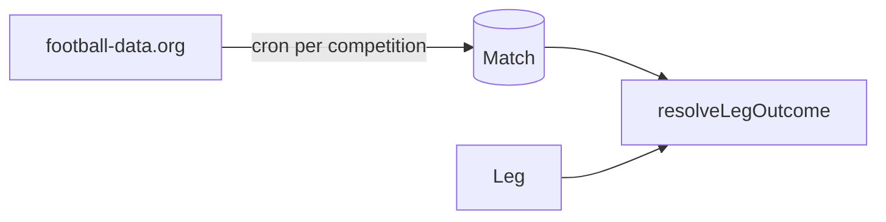

# Spec: Competitions & shared results

| Field | Value |
|-------|-------|
| **Status** | Partially implemented (odds UX done; picker & Match table not) |
| **Depends on** | — |
| **Blocks** | Member stats favourites (`competitionId` on legs) |
| **As-built reference** | [../CURRENT_STATE.md](../CURRENT_STATE.md) |

---

## Goals

1. **Curated competitions** — English football leagues + FIFA World Cup (expand later).
2. **Per-leg competition picker** — each member chooses their own competition before fixtures (cross-competition accas are intentional).
3. **Shared match results** — one canonical result per fixture, polled once per competition, reused by all groups.

---

## Implemented (do not re-build)

### Odds UX

- **Leg submit:** best retail odds only — `sortQuotesByBestOdds`, no bookmaker picker.
- **Acca lock:** `findBestAccaBookmaker` in `lib/odds/acca.ts`, `lockRoundWithAccaPricing` in `lib/odds/lock-round.ts`.
- **UI:** `AccaSummary` in `group-ui.tsx`.

If no single bookmaker covers all legs → show best-per-leg combined odds; no unified betslip.

---

## Phase 1 competitions (catalogue)

| Slug | Display name | The Odds API `sport_key` | football-data `code` |
|------|--------------|--------------------------|----------------------|
| `epl` | Premier League | `soccer_epl` | `PL` |
| `championship` | Championship | `soccer_efl_champ` | `ELC` |
| `league-one` | League One | `soccer_england_league1` | `EL1` |
| `league-two` | League Two | `soccer_england_league2` | `EL2` |
| `world-cup` | FIFA World Cup | `soccer_fifa_world_cup` | `WC` |

**Phase 1b:** FA Cup (`soccer_fa_cup` / `FAC`), EFL Cup.

Add catalogue: `packages/shared/src/competitions.ts`.

---

## UX: competition before fixtures (per leg)

```
Submit leg form
  1. Pick competition
  2. Pick fixture (filtered)
  3. Pick market → selection (best odds)
  4. Submit
```

- **No `competitionId` on `Round`** — rounds are competition-agnostic.
- `Leg.competitionId` (slug) + existing `Leg.competition` (display name).
- `GET /api/fixtures?competition=epl` — replace global `ODDS_API_SPORT` default.

---

## Data model (planned)

```prisma
model Leg {
  competitionId String  // NEW slug
  competition   String  // exists
  matchId       String? // NEW FK → Match
}

model Match {
  id              String    @id @default(cuid())
  competitionId   String
  kickoff         DateTime
  homeTeam        String
  awayTeam        String
  status          String    @default("SCHEDULED")
  homeGoals       Int?
  awayGoals       Int?
  externalOddsId  String?   @unique
  externalDataId  Int?      @unique
  lastSyncedAt    DateTime?
  @@index([competitionId, kickoff])
}
```

---

## Results sync (planned)



- Ingest: `GET /v4/competitions/{code}/matches` on schedule.
- Settle: read `Match` table — no per-group API calls.
- Endpoint: `POST /api/internal/sync-matches` (cron secret).

---

## API changes (planned)

| Endpoint | Change |
|----------|--------|
| `GET /api/competitions` | Active catalogue |
| `GET /api/fixtures?competition=` | Filter by sport key |
| `POST /api/legs` | Validate `competitionId` |
| Auto-settle | Read from `Match` not football-data live |

---

## Implementation checklist

### Phase A — Competition picker

- [ ] `packages/shared/src/competitions.ts`
- [ ] `GET /api/competitions`
- [ ] Competition step in `SubmitLegForm`
- [ ] `GET /api/fixtures?competition=`
- [ ] `Leg.competitionId` migration

### Phase B — Match table + ingest

- [ ] `Match` model + migration
- [ ] Sync job
- [ ] Auto-settle from DB

### Phase C — Hands-off

- [ ] Post-ingest auto-settle
- [ ] Notifications

---

## Open questions

1. Ship EPL + World Cup first, or all five leagues?
2. Per-leg deeplinks when no single acca bookmaker?
3. Ingest frequency — hourly vs match-day?
