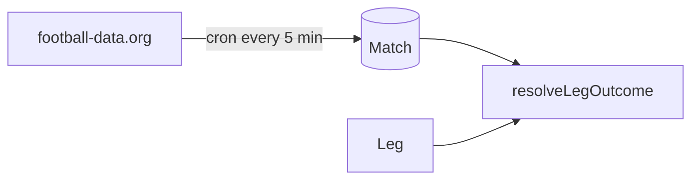

# Spec: Competitions & shared results

| Field | Value |
|-------|-------|
| **Status** | Phases A–C done |
| **Depends on** | — |
| **As-built reference** | [../CURRENT_STATE.md](../CURRENT_STATE.md) |

---

## Goals

1. **Curated competitions** — English leagues, top European divisions, and FIFA World Cup (expand later).
2. **Per-leg competition picker** — each member chooses their own competition before fixtures (cross-competition accas are intentional).
3. **Shared match results** — one canonical result per fixture, polled once per competition, reused by all groups.

---

## Implemented (do not re-build)

### Odds UX

- **Leg submit:** best retail odds only — `sortQuotesByBestOdds`, no bookmaker picker.
- **Acca lock:** `rankAccaBookmakers()` + `findBestAccaBookmaker` in `lib/odds/acca.ts`, `lockRoundWithAccaPricing` in `lib/odds/lock-round.ts`.
- **UI (collecting):** leg picker shows best odds per selection.
- **UI (locked):** frozen leg + combined odds, per-leg outcome badges, no bookmaker comparison; betslip links until first result.

If no single bookmaker covers all legs → best-per-leg combined odds locked at submission; per-leg deeplinks at lock.

### Competition picker (Phase A)

- Catalogue: `packages/shared/src/competitions.ts`
- `GET /api/competitions`, `GET /api/fixtures?competition=`, `Leg.competitionId`
- 4-step `SubmitLegForm`: competition → fixture → market → selection

### Match table + sync (Phase B)

- `Match` model, `Leg.matchId` FK
- `POST /api/internal/sync-matches` (Bearer `CRON_SECRET`)
- Sync **bypasses** football-data in-memory cache (`bypassCache: true`) for fresh results every cron run
- Stores **90-minute (regulation)** scores via `score.regularTime` when extra time is played; otherwise `fullTime`
- Auto-settle reads from `Match` table via `match-store.ts` (UTC kickoff day matching)
- Cloud Scheduler: every 5 min UTC in production (`europe-west2`, job `sync-matches`)
- **Progressive outcomes:** `persistResolvableLegOutcomes()` updates leg `outcome` as matches finish; round settles when all legs ready
- **Exactly-once:** `applyRoundSettlement()` is transactional and claims the round with an atomic `locked → settled` `updateMany`, so an overlapping cron and owner settle never double-count points (loser throws `RoundNotSettleableError`, treated as a no-op)

---

## Phase 1 competitions (catalogue)

| Slug | Display name | The Odds API `sport_key` | football-data `code` |
|------|--------------|--------------------------|----------------------|
| `epl` | Premier League | `soccer_epl` | `PL` |
| `championship` | Championship | `soccer_efl_champ` | `ELC` |
| `la-liga` | La Liga | `soccer_spain_la_liga` | `PD` |
| `ligue-1` | Ligue 1 | `soccer_france_ligue_one` | `FL1` |
| `serie-a` | Serie A | `soccer_italy_serie_a` | `SA` |
| `bundesliga` | Bundesliga | `soccer_germany_bundesliga` | `BL1` |
| `world-cup` | FIFA World Cup | `soccer_fifa_world_cup` | `WC` |

**Phase 1b (backlog):** FA Cup (`soccer_fa_cup` / `FAC`), EFL Cup.

---

## UX: competition before fixtures (per leg)

```
Submit leg form
  1. Pick competition
  2. Pick fixture (filtered)
  3. Pick market → selection (best odds)
  4. Submit
```

- **No `competitionId` on `Round`** — rounds are competition-agnostic.
- `Leg.competitionId` (slug) + existing `Leg.competition` (display name).

---

## Data model (as-built)

```prisma
model Leg {
  competitionId String
  competition   String
  matchId       String?  // FK → Match
}

model Match {
  id              String    @id @default(cuid())
  competitionId   String
  kickoff         DateTime
  homeTeam        String
  awayTeam        String
  status          String    @default("SCHEDULED")
  homeGoals       Int?
  awayGoals       Int?
  externalOddsId  String?   @unique
  externalDataId  Int?      @unique
  lastSyncedAt    DateTime?
  @@index([competitionId, kickoff])
}
```

Full schema: `packages/database/prisma/schema.prisma`

---

## Results sync (as-built)



- Ingest: `GET /v4/competitions/{code}/matches` on schedule (cache bypassed on cron sync).
- Settle: read `Match` table — one result per fixture, shared across all groups; no per-group API calls at settle time.
- Endpoint: `POST /api/internal/sync-matches` (Bearer `CRON_SECRET`). Logs pending settle reasons to Cloud Run stdout.

**Known:** football-data.org free tier covers all catalogue leagues; EPL/Championship may be empty off-season.

---

## API (as-built)

| Endpoint | Status |
|----------|--------|
| `GET /api/competitions` | ✅ Active catalogue |
| `GET /api/fixtures?competition=` | ✅ Filter by sport key |
| `POST /api/legs` | ✅ Validates `competitionId` |
| `POST /api/internal/sync-matches` | ✅ Cron sync |
| `POST /api/rounds/[id]/auto-settle` | ✅ Reads from `Match` (owner-triggered) |

---

## Implementation checklist

### Phase A — Competition picker ✅

- [x] `packages/shared/src/competitions.ts`
- [x] `GET /api/competitions`
- [x] Competition step in `SubmitLegForm`
- [x] `GET /api/fixtures?competition=`
- [x] `Leg.competitionId` migration

### Phase B — Match table + ingest ✅

- [x] `Match` model + migration
- [x] Sync job + Cloud Scheduler
- [x] Auto-settle from DB

### Phase D — Admin competition control ✅

- [x] `CompetitionSetting` model + migration (World Cup enabled by default)
- [x] `GET /api/competitions` returns enabled competitions only
- [x] `GET/PATCH /api/admin/competitions` + `/admin/competitions` UI
- [x] Fixture feed: `commenceTimeFrom=now`, upcoming filter, no mock fallback when `ODDS_API_KEY` set

---
- [x] In-progress locked round UI — outcome badges, locked odds only, 60s client poll

---

## Decisions (resolved)

| Question | Decision |
|----------|----------|
| Ship EPL + World Cup first, or all five? | **All five** shipped in Phase A |
| Ingest frequency | **Every 5 min UTC** via Cloud Scheduler (`*/5 * * * *`) |
| Per-leg deeplinks when no single acca bookmaker? | Per-leg **Open** links at lock via The Odds API `includeLinks`; hidden once results start |
| Show bookmaker comparison after lock? | **No** — frozen odds only; rankings stored for deeplinks at lock |
