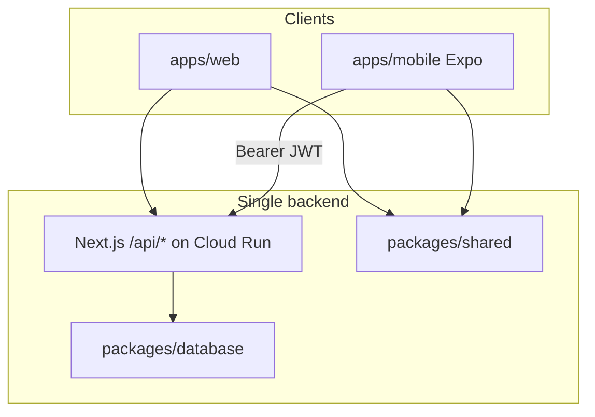

# Spec: iPhone & Android apps

| Field | Value |
|-------|-------|
| **Status** | Phase 5 store release **ready** — EAS wired; operator submit pending |
| **Depends on** | Web MVP + production API ([../CURRENT_STATE.md](../CURRENT_STATE.md)) |
| **Target** | **Functional parity** with the website for member-facing flows |

---

## Vision

We want **native iPhone (App Store)** and **Android (Play Store)** apps so syndicate members can:

- Sign in and manage groups on mobile
- Pick legs (competition, fixture, market, selection) with the same odds behaviour as the web
- View locked accas, compare bookmakers, and open betslips at licensed operators
- Track in-progress leg results and leaderboards / performance stats

The apps are **not** a bookmaker. All copy and UI must make clear users place bets with licensed operators (see [../BRAND.md](../BRAND.md)).

Apps call the **same production API** as the website (`https://www.the-syndicate.uk`). There is no separate mobile backend.

**Platform admin** (`/admin/*`) is **out of scope** for v1 parity — web only.

---

## Architecture (API-first)



### Hard rules (anti-divergence)

| Rule | Rationale |
|------|-----------|
| **No direct DB access** from mobile | Single source of truth on server |
| **No duplicated business logic** in `apps/mobile` | Odds, settlement, scoring, acca ranking live in `apps/web/src/lib/` only |
| **API changes ship on web first** | Mobile follows; web deploy is the contract owner |
| **Validate requests with shared Zod** | `packages/shared/src/schemas.ts` — e.g. `submitLegSchema` requires `competitionId` |
| **Display points from server data** | Use `packages/shared/src/scoring.ts` for display helpers only; never reimplement settlement rules on device |

### Auth (already built)

| Piece | Location |
|-------|----------|
| Mobile sign-in | `POST /api/auth/mobile/sign-in` |
| JWT creation / verify | `apps/web/src/lib/mobile-token.ts` |
| API auth (cookie or Bearer) | `apps/web/src/lib/api-auth.ts` → `requireSession()` |
| Token storage | `apps/mobile/src/auth/AuthProvider.tsx` (Expo SecureStore) |

Web uses Auth.js cookies; mobile uses **Bearer JWT** on every API call.

### Rejected approaches

| Approach | Why not |
|----------|---------|
| **Capacitor / WebView** wrapping Next.js | Cookie/SSR friction, weak native UX, hard to match app store expectations |
| **Separate backend or Flutter rewrite** | Maximum divergence from web; duplicate logic risk |
| **PWA only** | No App Store / Play presence; limited iOS install UX |

---

## What exists today (paused scaffold)

`apps/mobile/` is an **Expo** app (Expo Router) with auth and basic group screens. It is **behind the web** and not store-ready.

| Area | Web | Mobile (`apps/mobile/`) |
|------|-----|-------------------------|
| Auth | Auth.js | Sign-in / sign-up + JWT |
| Groups list | `/dashboard` | `app/(main)/index.tsx` |
| Create / join | `/groups/create`, `/groups/join` | `create-group.tsx`, `join-group.tsx` |
| Group round | `group-ui.tsx` (full) | `groups/[id].tsx` + `components/group-round.tsx` |
| Leg picker | 4-step + competition + market tiers | `SubmitLegForm` — competition, tiers (core + load more), grouped markets |
| Locked acca | `AccaSummary`, compare bookmakers until first result | `AccaSummary` + `LegsList` with outcomes; 60s poll when locked |
| Group tabs | Round / Leaderboard / Performance | `groups/[id]/_layout.tsx` + tab screens |
| Cross-group performance | `/performance` | `(main)/performance.tsx` |
| Admin | `/admin/*` | **Out of scope** |

**Tech debt (remaining):** Zod response schemas still implicit; deep links (Phase 4). Line charts use `react-native-svg` on mobile (member multi-series still tabular).

---

## Reducing duplicated effort and artifacts

Parity means **same flows and data**, not pixel-identical UI. Web uses Tailwind; mobile uses React Native — separate component trees, shared contracts.

### Shared contract layer (monorepo)

| Artifact | Today | Target when resuming |
|----------|-------|----------------------|
| Types (`Fixture`, `AccaBookmakerRanking`, etc.) | `packages/shared` | Extend as APIs evolve |
| Request schemas | `packages/shared/src/schemas.ts` | Mobile imports before every POST |
| Response schemas | Mostly implicit in API routes | Add Zod response schemas in shared (Phase 0 backlog) |
| Scoring / points display | `packages/shared/src/scoring.ts` | Import on mobile; never recompute server rules |
| Competitions catalogue | `packages/shared/src/competitions.ts` | Shared picker labels |
| Brand colours + tagline | `packages/shared/src/brand.ts` + web `globals.css` | Mobile `config.ts` imports `BRAND_COLORS` from shared |
| Logo | Web SVG `apps/web/src/components/logo.tsx` | Export PNGs for app icon / splash — see [../BRAND.md](../BRAND.md#cross-platform-brand) |
| API response types | `packages/shared/src/api-types.ts` | Extend as APIs evolve |
| Market grouping + best odds | `packages/shared/src/market-groups.ts`, `bookmakers.ts` | Web re-exports from shared; mobile leg picker uses same helpers |

### Release discipline

1. **Vertical slices** — each mobile screen calls the same endpoints as its web page (see parity matrix below).
2. **Breaking API changes** — update shared schema + web + mobile in one PR when possible.
3. **Optional later** — contract tests or OpenAPI generated from Zod schemas.

---

## Parity matrix (member-facing)

Checklist for implementation. Web route → API → mobile screen.

| Web flow | Key APIs | Mobile screen / work |
|----------|----------|----------------------|
| Sign up | `POST /api/auth/sign-up` | `app/sign-up.tsx` |
| Sign in | `POST /api/auth/mobile/sign-in` | `app/sign-in.tsx` |
| Dashboard | `GET /api/groups` | `app/(main)/index.tsx` |
| Create group | `POST /api/groups` | `app/(main)/create-group.tsx` |
| Join group | `POST /api/groups/join` | `app/(main)/join-group.tsx` |
| Group round | `GET /api/groups/[id]` | `app/(main)/groups/[id].tsx` |
| Leg picker | `GET /api/competitions`, `GET /api/fixtures?competition=`, `GET /api/fixtures/[id]/markets?tier=` | Extend `SubmitLegForm` in `[id].tsx` |
| Submit leg | `POST /api/legs` (body includes `competitionId`) | Same |
| Locked round | `accaBookmakerRankings`, `betslipLink`, `betslipLinks` in group payload | `AccaSummary` equivalent + `LegsList` |
| Group leaderboard | `leaderboard` in group payload | Tab or section |
| Group performance | `GET /api/groups/[id]/stats` | New tab / screen |
| Member stats | `GET /api/groups/[id]/members/[userId]/stats` | Drill-down from performance |
| Cross-group performance | `GET /api/user/stats` | New screen (web `/performance`) |
| Round history | `recentRounds` in group payload | Section on group screen |

### Explicitly out of v1 parity

| Item | Notes |
|------|-------|
| `/admin/*` | Platform admin — web only |
| Marketing pages (`/`, `/about`) | Optional lightweight “About” in app later |
| Email notifications | Server-side only; no mobile-specific work |

---

## Phased implementation plan

**Goal:** parity with the website. **Gate:** prefer starting full UI work after [web validation with real users](../ROADMAP.md) — foundation / shared-contract work can proceed in parallel.

### Phase 0 — Spec and contracts (this document)

- [x] Document vision, architecture, parity matrix, release process
- [ ] Add Zod response schemas for key API payloads in `packages/shared`
- [x] Centralize brand tokens (`packages/shared/src/brand.ts`); marketing copy still web-only

### Phase 1 — Foundation

- [x] Remove duplicated types from `apps/mobile/src/api/client.ts`; use `packages/shared/src/api-types.ts`
- [x] Align mobile colours with web Turf Green tokens (`BRAND_COLORS` → `config.ts`)
- [x] Fix leg submit: `GET /api/fixtures?competition=`, `competitionId` on `POST /api/legs`
- [x] `EXPO_PUBLIC_API_URL` → production in EAS profiles (`eas.json`)

### Phase 2 — Core loop

- [x] Full 4-step leg picker (competition → fixture → market → selection)
- [x] Market tiers: auto-load core; “Load more markets” for specials (no API credit copy in UI)
- [x] Locked round: picks, outcome badges, frozen odds (`LegsList`, `RoundProgress`)
- [x] `AccaSummary`: combined odds, compare bookmakers until first result, betslip CTA
- [x] ~~Owner settle / auto-settle~~ — removed July 2026: settlement is system-only; members edit their own pick until first kickoff instead (`SubmitLegForm` edit mode)

### Phase 3 — Stats and navigation

- [x] Group tabs: Round / Leaderboard / Performance (`group-nav.tsx`, nested routes)
- [x] Cross-group performance screen (`GET /api/user/stats` → `(main)/performance.tsx`)
- [x] Round history section (`RoundHistory` on round tab)
- [x] Group performance tab (`GET /api/groups/[id]/stats`, member drill-down)

### Phase 4 — Polish

- [x] Pull-to-refresh + 60s poll while acca locked (match web `GroupDataProvider`) — poll shipped Phase 2; refresh was already present
- [x] Deep links: `the-syndicate://` scheme, invite `?code=` handling (`app/groups/join.tsx`, pending invite after sign-in)
- [x] Error / empty states aligned with web messaging (`apps/mobile/src/lib/copy.ts`, `EmptyState`)
- [x] Responsible gambling disclosure near betslip + footer (`compliance.tsx`) — affiliate commission copy deferred until [affiliate-and-betslips.md](./affiliate-and-betslips.md) ships

### Phase 5 — Store release

- [x] EAS Build profiles (`apps/mobile/eas.json` — development, preview, production)
- [x] CI workflow (`.github/workflows/eas.yml`) — `EXPO_TOKEN`, tag `mobile-v*`
- [x] Store listing copy ([apps/mobile/STORE_LISTING.md](../../apps/mobile/STORE_LISTING.md))
- [x] Splash screen + universal link config in `app.json` (icons in `assets/` — re-export from Acca stack when rebranding)
- [ ] **Operator:** `eas init`, Apple/Google developer accounts, TestFlight / Play internal → production submit — **deferred** until friend validation ([FRIEND_TESTING.md](../../apps/mobile/FRIEND_TESTING.md))

---

## Distribution strategy

**Decision (July 2026):** Do **not** pay Apple Developer (~£99/yr) or Google Play Console (~£25) until real friend groups have completed the full acca loop on production. Store infrastructure (`eas.json`, listing copy, CI) is ready; **paid store accounts are a post-validation step**.

| Phase | Channel | Cost | Audience |
|-------|---------|------|----------|
| **Now — developer** | Expo Go, iOS Simulator, or `expo run:ios --device` | £0 | You — native app testing |
| **Now — friends** | Android preview APK (`eas build --profile preview`) | £0 store fee | Android mates |
| **Fallback** | Web PWA (Add to Home Screen) | £0 | iPhone mates only if TestFlight delayed |
| **After validation** | TestFlight (iOS) | Apple Developer ~£99/yr | iPhone TestFlight testers |
| **After validation** | Play internal / production | Play Console ~£25 once | Play Store (optional) |

Operational guides: [DEVELOPER_TESTING.md](../../apps/mobile/DEVELOPER_TESTING.md) · [FRIEND_TESTING.md](../../apps/mobile/FRIEND_TESTING.md).

---

## Build and deploy (native)

Mobile is **not** deployed by [`.github/workflows/deploy.yml`](../../.github/workflows/deploy.yml). See [../DEPLOYMENT.md](../DEPLOYMENT.md#mobile-apps-ios-and-android).

| Item | Value |
|------|-------|
| Framework | Expo SDK ~54, Expo Router |
| Package | `apps/mobile` |
| iOS bundle ID | `com.thesyndicate.app` |
| Android package | `com.thesyndicate.app` |
| API env | `EXPO_PUBLIC_API_URL` (see `apps/mobile/.env.example`) |
| Build service | [EAS Build](https://docs.expo.dev/build/introduction/) — [eas.json](../../apps/mobile/eas.json), [eas.yml](../../.github/workflows/eas.yml) |
| Scheme | `the-syndicate` (`app.json`) |

Local dev:

```bash
cd apps/mobile
cp .env.example .env   # EXPO_PUBLIC_API_URL=http://localhost:3000
npm run ios    # or npm run android
```

---

## Brand across three surfaces

| Surface | Logo | Copy / tagline | Colours |
|---------|------|----------------|---------|
| **Website** | SVG `logo.tsx` | `lib/marketing-content.ts` | `globals.css` tokens |
| **App (in-app)** | Wordmark + optional mark component | Import shared copy module | Shared tokens |
| **App Store / Play** | PNG icon + screenshots | Listing text (manual) | N/A |

**Recommendation:** Lock logo and tagline before heavy mobile UI work and store submission. Centralize tokens and copy once to avoid updating three places on every rebrand.

Details: [../BRAND.md](../BRAND.md#cross-platform-brand).

---

## Open questions

| Question | Default / notes |
|----------|-----------------|
| Store developer fees? | **Deferred** for friend distribution — developer tests natively via Expo Go / device build ([DEVELOPER_TESTING.md](../../apps/mobile/DEVELOPER_TESTING.md)) |
| Push notifications? | Post-v1; round lock / settle |
| In-app sign-up vs web-only? | Keep in-app sign-up (scaffold exists) |
| Admin on tablet? | Defer; web admin only |
| Offline / poor network? | Show cached group state where safe; odds require network |
| CORS for mobile? | Bearer auth on API routes; revisit if browser-based Expo web |

Record decisions here when resolved.

---

## Related docs

| Doc | Purpose |
|-----|---------|
| [../ARCHITECTURE.md](../ARCHITECTURE.md) | Stack overview |
| [../PRODUCT.md](../PRODUCT.md) | User flows |
| [../BRAND.md](../BRAND.md) | Visual identity + cross-platform brand |
| [../DEPLOYMENT.md](../DEPLOYMENT.md) | EAS / store release + friend testing without store fees |
| [../ROADMAP.md](../ROADMAP.md) | Priority and phases |
