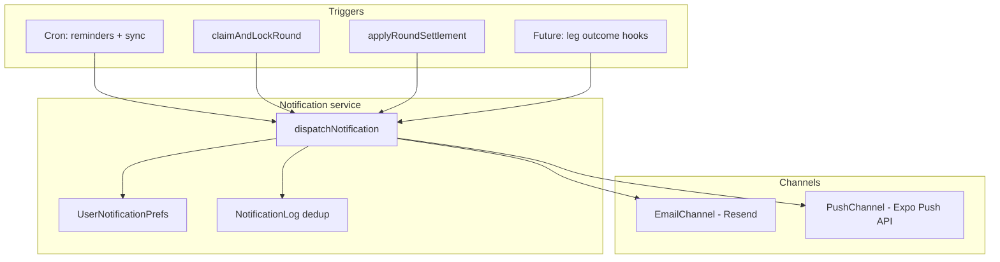

# Spec: Notifications (email + push)

| Field | Value |
|-------|-------|
| **Status** | Shipped (July 2026) — Phase 1–2 |
| **Depends on** | Auth, rounds lifecycle, Resend (email, optional today), Expo mobile app |
| **As-built reference** | [../CURRENT_STATE.md](../CURRENT_STATE.md) — email lock/settle only |

---

## Goals

1. **Keep syndicates on schedule** — remind members to submit before kickoff deadline ([round-deadline-lock.md](./round-deadline-lock.md)).
2. **Surface acca lifecycle** — lock, in-progress legs, settle (today: lock + settle email only).
3. **One notification model** — same events, channels (email + push), preferences, and deduplication.
4. **Mobile-first for urgency** — push for time-sensitive nudges; email for receipts and detail.

**Non-goals (v1):** SMS, in-app chat, marketing newsletters, web push (browser).

---

## As-built today

| Event | Email | Push | Dedup |
|-------|-------|------|-------|
| Acca locked | ✅ Resend (`notifyRoundLocked`) | — | `Round.lockedNotificationSentAt` |
| Round settled | ✅ Resend (`notifyRoundSettled`) | — | `Round.settledNotificationSentAt` |
| Pick reminder (deadline) | — | — | — |
| Leg won/lost (in progress) | — | — | — |
| Invite / welcome | — | — | — |

**Code:** `apps/web/src/lib/notifications/email.ts`, `round-notifications.ts`.  
**Env:** `RESEND_API_KEY`, `EMAIL_FROM` — no-op if unset ([DEPLOYMENT.md](../DEPLOYMENT.md#email-notifications-resend)).

**Gap:** emails are fire-and-forget HTML strings; no user preferences; no push tokens; reminders not implemented.

---

## Notification catalogue (target)

| ID | Event | Priority | Email | Push | Typical recipient |
|----|-------|----------|-------|------|-------------------|
| `pick_reminder` | Open round, member has no leg, deadline within window | High | ✅ | ✅ | Pending members only |
| `round_locked` | Acca locked (full or partial) | High | ✅ | ✅ | All group members |
| `round_settled` | Acca settled | Medium | ✅ | ✅ | All group members |
| `leg_result` | Member's leg resolved while acca still open | Low | Optional | ✅ | Leg owner (+ optional group) |
| `acca_won` | All legs won (celebration) | Low | Optional | ✅ | All group members |
| `welcome` | Sign-up complete | Low | ✅ | — | New user |

**Phase 1 (recommended):** `pick_reminder`, `round_locked`, `round_settled` — covers accountability + deadline UX.  
**Phase 2:** `leg_result`, `acca_won` — higher volume; needs throttling.

---

## Architecture



### Design principles

1. **Single entry point** — `dispatchNotification({ type, userId, groupId?, roundId?, payload })` in `apps/web/src/lib/notifications/dispatch.ts`.
2. **Channel adapters** — `EmailChannel`, `PushChannel` implement a shared interface; easy to add SMS later.
3. **User preferences** — per-channel toggles per notification type (defaults on for transactional).
4. **Dedup log** — `NotificationLog` rows prevent duplicate reminders (not just round-level timestamps).
5. **Deep links** — every message links to `https://www.the-syndicate.uk/groups/{id}` or `the-syndicate://groups/{id}` on mobile.
6. **Fail open on email** — if Resend unset, skip silently (today's behaviour). Push skips if no token.
7. **Async** — dispatch after HTTP response / after settlement transaction commits (`void dispatch(...)`).

---

## Data model (proposed)

```prisma
model PushDevice {
  id        String   @id @default(cuid())
  userId    String
  user      User     @relation(fields: [userId], references: [id], onDelete: Cascade)
  token     String   @unique  // Expo push token
  platform  String   // "ios" | "android"
  createdAt DateTime @default(now())
  updatedAt DateTime @updatedAt
  lastUsedAt DateTime @default(now())

  @@index([userId])
}

model NotificationPreference {
  id        String @id @default(cuid())
  userId    String @unique
  user      User   @relation(...)
  emailPickReminder    Boolean @default(true)
  emailRoundLocked     Boolean @default(true)
  emailRoundSettled    Boolean @default(true)
  pushPickReminder     Boolean @default(true)
  pushRoundLocked      Boolean @default(true)
  pushRoundSettled     Boolean @default(true)
  // Phase 2: pushLegResult, etc.
}

model NotificationLog {
  id        String   @id @default(cuid())
  userId    String
  type      String   // e.g. pick_reminder_2h
  roundId   String?
  groupId   String?
  channel   String   // email | push
  sentAt    DateTime @default(now())

  @@unique([userId, type, roundId, channel])  // idempotent reminders
  @@index([roundId])
}
```

Keep `Round.lockedNotificationSentAt` / `settledNotificationSentAt` for **round-wide** emails during migration; new code can write both log + legacy fields until refactor complete.

---

## Email channel

### Provider

Stay on **Resend** — already wired, domain verified, GCP secrets in place.

### Improvements over today

| Area | Today | Target |
|------|-------|--------|
| Templates | Inline HTML strings | Shared templates in `lib/notifications/templates/` |
| Personalisation | Group broadcast | Per-recipient where needed (reminders) |
| Preferences | None | Respect `NotificationPreference` |
| Unsubscribe | None | Link to `/settings/notifications` (one-click email off per type) |
| Batching | All members one `to[]` | Per-user sends for reminders (clearer analytics, per-user dedup) |

### Pick reminder email (Phase 1)

**Trigger:** cron finds open rounds with ≥1 leg where `firstKickoff` is within **2 hours** and member has no leg.

**Subject:** `{groupName} — pick your leg (locks {time})`

**Body:** deadline, count waiting, CTA button → group round tab.

**Dedup:** `NotificationLog` type `pick_reminder_2h` per user per round.

Optional later: `pick_reminder_24h`, `pick_reminder_30m`.

### Transactional classification

Lock/settle/reminder emails are **transactional** (user is in the group, action affects them). No marketing consent required; still offer opt-out for reminders. Include physical address / company line in footer for compliance.

---

## Push channel

### Provider: Expo Push Notifications

Mobile app already uses **Expo SDK 54** with EAS build profiles. Recommended path:

- Client: `expo-notifications` + `expo-device`
- Server: [Expo Push API](https://docs.expo.dev/push-notifications/sending-notifications/) via `fetch` (no Firebase SDK in Next.js required for v1)
- EAS credentials manage **APNs** (iOS) and **FCM** (Android) — see [Expo push setup](https://docs.expo.dev/push-notifications/push-notifications-setup/)

**Why Expo Push:** one HTTP API for both platforms; fits existing `apps/mobile` + EAS pipeline; no separate FCM server key in Cloud Run initially.

### Mobile work

| Task | Detail |
|------|--------|
| Install | `expo-notifications`, `expo-device` |
| `app.json` | iOS `UIBackgroundModes: remote-notification`; Android notification icon/color |
| Permission UX | Prompt after first group join or on dashboard — explain kickoff reminders |
| Token registration | `POST /api/user/push-token` `{ token, platform }` on login + token refresh |
| Handlers | Tap notification → `router.push('/(main)/groups/{id}')` via deep link payload |
| Physical device | Push does not work in iOS Simulator (Android emulator OK with Google Play) |

### Server work

| Task | Detail |
|------|--------|
| `PushChannel` | `lib/notifications/push-channel.ts` — batch tokens, call Expo API |
| Invalid tokens | On `DeviceNotRegistered`, delete `PushDevice` row |
| Payload | `{ title, body, data: { url, groupId, roundId, type } }` |
| Secrets | Optional `EXPO_ACCESS_TOKEN` for higher rate limits (EAS) |

### Web

No web push in v1 — web users rely on email.

---

## Cron & scheduling

| Job | Schedule | Action |
|-----|----------|--------|
| `sync-matches` | 5 min (existing) | + `lockOpenRoundsAtKickoff` (shipped) |
| **`round-reminders`** | **15 min** (new) | `sendPickReminders()` for T−2h window |
| Future | On settle | Optional digest |

**New route:** `POST /api/internal/round-reminders` (Bearer `CRON_SECRET`), Terraform Cloud Scheduler job.

**Reminder algorithm (`sendPickReminders`):**

```
for each open round with legs.length >= 1:
  deadline = firstKickoff(legs)
  if deadline is null or deadline <= now: continue
  if deadline > now + 2h: continue
  if deadline < now + 1h45m: continue   // 15-min cron window
  pendingMembers = members without a leg
  for each pending member:
    dispatch pick_reminder (email + push per prefs)
```

Skip rounds with zero legs (no deadline anchor) — matches [round-deadline-lock.md](./round-deadline-lock.md) open question.

---

## API routes (proposed)

| Route | Auth | Purpose |
|-------|------|---------|
| `POST /api/user/push-token` | Session / mobile JWT | Register or refresh Expo token |
| `DELETE /api/user/push-token` | Session | Logout / disable push on device |
| `GET /api/user/notification-preferences` | Session | Read prefs |
| `PATCH /api/user/notification-preferences` | Session | Update toggles |
| `POST /api/internal/round-reminders` | Cron secret | Send pick reminders |

Refactor `notifyRoundLocked` / `notifyRoundSettled` to call `dispatchNotification` internally.

---

## User settings UI

| Surface | Location | Controls |
|---------|----------|----------|
| Web | `/settings/notifications` (new) or section on `/performance` | Email / push toggles per type |
| Mobile | Settings screen (new tab or profile) | Same toggles + system permission status |

Default: all transactional notifications **on**. Copy: *"Remind me to pick before kickoff"* — ties to product accountability.

---

## Build phases

### Phase 0 — Refactor (1–2 days)

- [x] `dispatch.ts` + channel interface
- [x] Migrate lock/settle emails to dispatcher (behaviour unchanged)
- [x] `NotificationLog` migration

### Phase 1 — Pick reminders + email polish (3–5 days)

- [x] `sendPickReminders()` + cron route + Terraform scheduler
- [x] Email templates for reminder, improved lock/settle templates
- [x] `NotificationPreference` model + API
- [x] Basic web settings page
- [x] Update [round-deadline-lock.md](./round-deadline-lock.md) Phase 2 checklist

**Prerequisite:** kickoff deadline lock shipped ✅

### Phase 2 — Push notifications (5–8 days)

- [x] `expo-notifications` in mobile app; token registration API
- [x] `PushDevice` model + `PushChannel`
- [x] Push for: pick reminder, round locked, round settled
- [x] Deep link handling on notification tap
- [ ] EAS credentials (APNs key, FCM) in production build profile — **required for production push**; Expo Go uses Expo's credentials for dev
- [x] Mobile notification settings screen
- [ ] Test on physical iOS + Android devices (operator)

### Phase 3 — Richer alerts (optional)

- [ ] Per-leg result push while acca in progress
- [ ] Acca won celebration
- [ ] Owner nudge: "3 members still haven't picked"
- [ ] Admin digest (stuck settlement queue) — web email only

---

## Cost & ops

| Item | Estimate |
|------|----------|
| Resend | Free tier ~3k emails/mo; reminders add volume linearly with groups × members |
| Expo Push | Free; rate limits apply — batch sends |
| Cloud Scheduler | +1 job (~$0.10/mo) |
| Cloud Run | Negligible extra CPU on cron |
| EAS | Existing; push credentials included in standard Expo workflow |

**Rate limits:** cap reminders to **one per user per round per window**; max **N groups** per user per hour (e.g. 5) to prevent notification storms for multi-group users.

---

## Compliance & product notes

- **GDPR:** lawful basis = legitimate interest for transactional; explicit opt-in not required for lock/settle; offer opt-out for reminders. Document in `/about` privacy section when settings ship.
- **Responsible gambling:** notification copy must not pressure betting — nudge to *submit a pick*, not to *place money*.
- **Not a bookmaker:** lock email already links to app, not bookmaker — keep that pattern.

---

## Open questions

| Question | Recommendation |
|----------|----------------|
| Remind before any leg submitted? | **No** — wait until `legs.length >= 1` |
| Quiet hours (e.g. 11pm–8am)? | **Phase 3** — skip non-urgent reminders unless T−30m |
| Per-group mute? | Defer — user-level prefs enough for v1 |
| Email all members on lock vs only participants? | **All members** (today) — includes those who missed deadline |
| Web push? | Defer |
| Use Firebase Admin directly? | Only if outgrow Expo Push; not v1 |

---

## Related docs

| Doc | Link |
|-----|------|
| Round deadline lock | [round-deadline-lock.md](./round-deadline-lock.md) |
| Mobile apps | [mobile-apps.md](./mobile-apps.md) |
| Deployment / Resend | [DEPLOYMENT.md](../DEPLOYMENT.md) |
| Roadmap | [ROADMAP.md](../ROADMAP.md) |

---

## File map (when built)

| Path | Role |
|------|------|
| `apps/web/src/lib/notifications/dispatch.ts` | Central dispatcher |
| `apps/web/src/lib/notifications/channels/email.ts` | Resend adapter |
| `apps/web/src/lib/notifications/channels/push.ts` | Expo Push adapter |
| `apps/web/src/lib/notifications/templates/*.ts` | HTML + push copy |
| `apps/web/src/lib/notifications/send-pick-reminders.ts` | Cron logic |
| `apps/web/src/app/api/user/push-token/route.ts` | Token registration |
| `apps/web/src/app/api/internal/round-reminders/route.ts` | Cron |
| `apps/mobile/src/notifications/` | Permission, token, handlers |
| `packages/shared/src/notification-types.ts` | Shared type enum + payload shapes |
