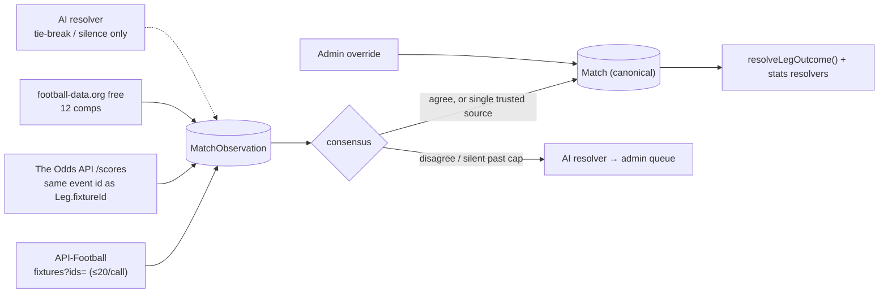

# Spec: Odds & results sourcing v2 (multi-source, ≤ £100/month)

| Field | Value |
|-------|-------|
| **Status** | **Phases 1–2 shipped 2026-09-23** (results consensus + corners settlement; see as-built notes under each phase). Phase 0 partly done; Phases 3–5 proposed |
| **Budget** | ≤ £100/month for odds **and** results combined (owner hard cap) |
| **Owner decisions** | 2026-09-22: betslip deeplinks are **low priority**. Keep them where a source already provides them; never pay for them or pick a source because of them |
| **Depends on** | — |
| **Related** | [ODDS_PROVIDERS.md](../ODDS_PROVIDERS.md) (provider research, §7 is the September 2026 re-evaluation), [competitions-and-results.md](./competitions-and-results.md), [live-matchday.md](./live-matchday.md), [estimated-odds-fill.md](./estimated-odds-fill.md), [affiliate-and-betslips.md](./affiliate-and-betslips.md), [season-readiness.md](./season-readiness.md) |

---

## TL;DR

- **Stop looking for one provider.** Nothing under £100/month has everything we need in one feed: UK bookmakers, bet365, deep markets, and results with stats. A small portfolio of providers does, for roughly **£40–£90/month** (§5).
- **Results → API-Football Pro ($19/month)** as the primary feed for every competition. It covers 1,200+ leagues and cups, gives the 90-minute score separately from extra time, corners and cards statistics, card-type and goal events, and live scores. This:
  - removes manual settlement for League One, League Two, the Carabao Cup, the Europa League and CL qualifiers;
  - unblocks the FA Cup;
  - makes the corners & cards tier we already sell auto-settleable;
  - answers live-matchday's open question about live scores.
- **Cross-check results instead of trusting one feed.** Store each provider's result as an *observation* and settle from consensus between three sources:
  - API-Football;
  - The Odds API `/scores`, which is keyed by the same event id our legs already store, so no team-name matching is needed;
  - football-data.org free (12 competitions).

  An **AI resolver** (Claude with web search) only breaks ties or fills silence. It never settles on its own.
- **Odds → keep The Odds API (bulk markets only) for UK bookmaker breadth, and add a depth feed.**
  - Betslip links are low priority (owner, 2026-09-22), so The Odds API earns its place only through the number of UK bookmakers it prices.
  - API-Football's odds come in the same subscription at no extra cost: bet365, William Hill and others, 100+ bet types, refreshed every 3 hours.
  - In parallel, trial the three sub-£50 feeds that claim UK depth (OddsPapi, UK Odds API Starter, TheStatsAPI) and adopt **at most one**.
- **Moving extended markets off The Odds API cuts its credit burn by ~90%** in a peak-season, 20-competition scenario (§5.1). We're already on the 20K plan ($30; probe, 22 Sept 2026), so this is what lets the catalogue grow without moving up to 100K ($59).
- **Don't retire The Odds API yet** (open decision 11). API-Football can't yet replace its UK bookmaker breadth, its Champions League odds or its freshness ([ODDS_PROVIDERS §7](../ODDS_PROVIDERS.md#7-september-2026-re-evaluation)).
- **API calls scale with competitions, not visitors** (§5.3). The site reads odds and results from Postgres; only crons call providers. The plan leaves ~5× headroom on API-Football even with the catalogue doubled to 40 competitions.
- **Not recommended:**
  - scraping bookmakers or Oddschecker;
  - the Betfair and Smarkets exchange APIs, which aren't licensed for commercial display (this **corrects** ODDS_PROVIDERS §3);
  - ESPN, FotMob and SofaScore hidden APIs;
  - Google Custom Search, which is closed to new customers and shuts on 2027-01-01.

  Full list in §4.

---

## 1. Problem (as-built, September 2026)

### Results

| Gap | Evidence |
|-----|----------|
| 6 catalogue competitions never auto-settle | `manualSettlement: true` on `league-one`, `league-two`, `champions-league-qual`, `europa-league`, `efl-cup` and `nations-league` (#61) (`packages/shared/src/competitions.ts`). The football-data.org free tier has none of them |
| FA Cup can't be added | [season-readiness.md](./season-readiness.md): `FAC` isn't on the free tier either |
| Corners & cards are sold but never auto-settle | `MatchResult` is only `{homeGoals, awayGoals, status}`. `resolveLegOutcome()` returns `null`, so every such leg falls into the admin queue ([ODDS_PROVIDERS §4](../ODDS_PROVIDERS.md#4-results-coverage-the-settlement-gap)) |
| No live scores | The football-data free tier delays scores. This is an open question in [live-matchday.md](./live-matchday.md) |
| Fragile leg ↔ match join | Legs are matched to matches by competition, UTC kickoff day, a substring team-name match and 3 hard-coded aliases (`lib/results/football-data.ts`, `lib/results/match-store.ts`). `Match.externalOddsId` exists (unique) but is **never written** |
| One feed, no second opinion | A wrong feed score is caught only by the 1h stability window, the 24h reconcile, or an admin |

### Odds

| Gap | Evidence |
|-----|----------|
| No bet365 | Not in The Odds API's `uk` region. It's the largest UK bookmaker |
| Thin extended markets on lower-profile fixtures | Lincoln Red Imps v Mjällby BTTS was priced by 2 UK bookmakers (verified live 2026-07-28). That's why [estimated-odds fill](./estimated-odds-fill.md) exists |
| Popular UK acca markets missing | No goalscorers from UK bookmakers (The Odds API's soccer player props are US-books only). No half-time result, HT/FT, team goals, win to nil, or result + BTTS |
| Depth cost scales per fixture | Core tier costs 5 credits per fixture per warm run, specials 7. A 20-competition peak weekend needs ~97K credits/month on today's design (§5.1) |

## 2. Requirements

| # | Requirement |
|---|-------------|
| R1 | Total spend on odds + results ≤ **£100/month**. Plan for ≤ ~£80 so VAT and FX swings don't break the cap |
| R2 | Auto-settle **every** competition we offer, including every market we sell. A market we can't settle isn't offered in that competition |
| R3 | More bookmakers (bet365 at minimum) and more markets in the picker, **UK-licensed bookmakers only** anywhere a user sees or locks a price |
| R4 | Betslip deeplinks are **nice-to-have** (owner, 2026-09-22): keep them where a source already provides them, but never pay for them or choose a source because of them. Hub links stay a labelled last resort (current behaviour) |
| R5 | More leagues, added by config: a catalogue entry plus an admin toggle |
| R6 | No new manual toil. The admin queue stays the escape hatch, not the workflow |
| R7 | Follow the [ODDS_PROVIDERS rules of thumb](../ODDS_PROVIDERS.md#6-rules-of-thumb): trial before committing, negative-cache failures, don't trust vendor marketing |

---

## 3. Target architecture

### 3.1 Results: observations → consensus → canonical `Match`



`Match` stays the one row that settlement reads, so the existing FT stability clock, `scoreLocked`, the 24h reconcile and the exactly-once settle keep working unchanged. What changes is **how `Match` gets written**: from a consensus of per-provider observations instead of a single feed.

**Consensus rules for goal-based markets** (90-minute score):

1. **Admin lock wins** (unchanged).
2. **Two-source agreement (C2).** At least 2 observations agree on terminal status and 90' score, and none disagree. Timing is unchanged: the FT score must be stable for 1h, capped at 4h. A faster confirmation for agreed results is open decision 5.
3. **Single source (C1).** Only one provider covers the match: today's rule applies (stable 1h, 4h cap). This is the rule every match uses today, because today there's only one feed.
4. **Disagreement.** Hold. If it's still unresolved at the 4h cap, run the AI resolver (§3.5):
   - If its answer matches one side **and** cites ≥2 independent publishers, that side wins.
   - Otherwise the match goes to the admin queue with every observation and the AI evidence shown side by side.
5. **Silence.** No terminal observation by KO + 4h: run the AI resolver.
   - If a structured provider later corroborates its answer, accept it.
   - Otherwise it appears as a one-click suggestion in the admin queue.
6. **Extra time.** When any provider reports AET or penalties, only providers that expose the regulation-time split may vote on the 90' score: API-Football `score.fulltime` and football-data `regularTime`. The Odds API `/scores` doesn't document ET handling, so it abstains.
7. **Reconcile (unchanged).** Consensus changes inside `RESULT_RECONCILE_MS` (24h) re-run `reconcileMatchLegOutcomes()`.

**Stats-based markets** (corners, cards, goalscorers). API-Football is the only stats source, so these are always single-source:

- **Settle** when the match is FINISHED in regulation and the stats are unchanged for `STATS_CONFIRMATION_MS` (proposed 2h). Stats get revised after the match more often than scores.
- **Extra time:** corners and cards legs go to the admin queue, because stats aren't split by period.
- **No coverage:** where API-Football lacks `statistics_fixtures` coverage for a league, **don't offer the corners & cards tier** in that competition (R2).

### 3.2 Link legs to matches by id, not by team name

- **At leg create or edit:** upsert a `Match` by `externalOddsId = leg.fixtureId` (the Odds API event id is already the fixture id) and set `leg.matchId` immediately. The Odds API `/scores` then joins with zero fuzz.
  - Outright legs are excluded (no match behind them).
  - `af:`-prefixed fixtures (§3.4) key on their API-Football id instead.
- **Every other provider maps its fixture onto that `Match` once** and stores its external id on its observation row. The rule: same competition, kickoff within ±3h, and both team names equal after normalisation plus a `TeamAlias` lookup.
- **Auto-learn aliases safely.** When exactly one fixture exists in that competition and time window, and one side matches, record the other side as an alias pair (`source: auto`). Anything ambiguous becomes an admin mapping suggestion. An LLM may *propose* the alias; it's never auto-applied.
- **Refactor the football-data sync from create-by-`externalDataId` to map-then-attach**, so one fixture never produces two `Match` rows.
- **Keep `findDbMatchForLeg()`'s fuzzy path** only as a fallback for legacy legs.

### 3.3 Settle what we sell (and unlock new markets)

| Market (canonical `marketType`) | Offered today? | Settles from | Rule / caveat |
|---|---|---|---|
| `match_winner`, `double_chance`, `draw_no_bet`, `both_teams_score`, `correct_score`, `over_under_*`, `asian_handicap_*` | Yes | 90' score (consensus) | Unchanged resolvers |
| `corners_1x2`, `corners_over_under_*`, `corners_handicap_*`, `team_corners__*` | Yes (specials) | API-Football `statistics` "Corner Kicks" | Regulation-only matches. ET goes to the admin queue. The `over_under_` guard in `resolve-leg.ts` stays; corners get their **own** branch |
| `cards_over_under_*`, `cards_handicap_*` | Yes (specials) | API-Football `events` (card type includes "second yellow") | Booking-point vs card-count rules differ by bookmaker. **Manual until [ODDS_PROVIDERS decision #4](../ODDS_PROVIDERS.md#5-open-decisions) is made**; the data to compute either convention is now available |
| `to_qualify` | Yes (specials) | API-Football winner after ET/pens | Needs the final (not 90') result, so it's the exception to rule 6 |
| `ht_result`, `ht_ft` | No (new) | `score.halftime` + 90' | Phase 3 |
| Team goals over/under, `win_to_nil`, `clean_sheet`, result + BTTS | No (new) | 90' score | Phase 3 |
| Anytime / first goalscorer | No (new) | API-Football `events` + `lineups` | Void when the player didn't take part. Needs player-name mapping to the odds source. Phase 3b |

`MatchResult` gains optional `halfTime` and `stats` fields. Each new resolver branch returns `null` when its data is missing, so a missing field routes to the admin queue rather than settling on the wrong statistic. Same principle as the load-bearing `over_under_` guard.

### 3.4 Odds: one market taxonomy, several sources

The existing seams already fit a multi-source design:

- mappers produce `Market[]` in our canonical taxonomy (`marketType` + `selectionId`);
- snapshots live in `OddsBulkSnapshot` and `OddsEventSnapshot`;
- `mergeMarketCollections()` already merges quotes **per bookmaker** and keeps whichever side has the deeplink.

Changes:

1. **`OddsSource` adapter interface** with `listFixtures(competition)` and `fetchMarkets(fixture, tier)`, returning canonical `Market[]`.
   - Move The Odds API code behind it first, with no behaviour change.
   - Then add `apiFootballOdds`, and one trial adapter per bake-off candidate behind a flag.
2. **Bookmaker identity.** Canonical keys stay The Odds API's (`williamhill`, `sport888`, `ladbrokes_uk`, …). Each adapter maps its bookmaker names to those keys, e.g. API-Football "Bet365" → `bet365`. **Unmapped bookmakers are dropped.**
3. **UK-licence allowlist** (`UK_LICENSED_BOOKMAKER_IDS`, `packages/shared/src/bookmakers.ts`), applied alongside the existing exchange filter. API-Football and OddsPapi carry many non-UK books (1xBet, Pinnacle, SBO, …), and those must never reach a user or a locked price.
4. **Quote provenance.** Add optional `source` and `fetchedAt` to `BookmakerQuote`. Old snapshots stay valid.
5. **Freshness-aware merge.** Today `mergeQuotes()` keeps the *higher* price for a bookmaker, which could prefer a 3-hour-old quote over a fresh one.
   - New rule: when two sources' `fetchedAt` differ by more than 30 min, the fresher quote wins.
   - Otherwise keep today's better-price rule.
   - Always keep a real deeplink for that bookmaker and selection.
6. **Fixture identity.** The Odds API event id stays the fixture id wherever The Odds API covers the competition, for `/scores` and continuity with existing legs. Other sources attach through the §3.2 mapping. For competitions The Odds API doesn't cover, use the API-Football fixture id with an `af:` prefix, like outright ids.
7. **Offer only what we can settle.** Every new market type ships with its resolver, `tierForMarketType()` and `marketGroupId()` entries, and unit tests in the same PR (R2).

**Which source serves which market (target):**

| Market family | Source(s) | Why |
|---|---|---|
| 1X2, goal totals, Asian handicap (featured) | The Odds API bulk (~17 UK retail books) **merged with** the depth feed (bet365 + extra books) | Bookmaker breadth |
| BTTS, double chance, correct score, alt lines, DNB | Depth feed. The Odds API core tier is retired | This is where The Odds API's UK books are thin, and it's what burns credits |
| Half-time, HT/FT, team goals, win to nil, combos | Depth feed | Not in The Odds API's UK feed today |
| Corners & cards | Depth feed. The Odds API specials tier is retired, so no user click calls a provider (§5.3) | Now settleable (§3.3) |
| Goalscorers | Depth feed | UK bookmakers absent from The Odds API's soccer props |

"Depth feed" means API-Football odds by default, or the bake-off winner if one is adopted (§6, Phase 0).

### 3.5 AI resolver (tie-break and long tail only)

**Why AI is used for results but not prices.** A final score is a stable, public, checkable fact that is reported by many independent publishers, so it can be corroborated. A price is volatile and must be exact. An LLM reading bookmaker pages would still be scraping, and it can misread numbers.

- **Trigger:** consensus rule 4 or 5 (§3.1).
  - At most one run per match.
  - Capped by `AI_RESOLVER_MAX_PER_DAY`.
  - Behind the `AI_RESOLVER_ENABLED` flag, default off.
- **Call:** Claude Messages API with the server-side `web_search` tool.
  - Model: `claude-opus-5`, the current default. A cheaper model is an option only after the offline eval shows it holds accuracy.
  - `max_uses` ≈ 5.
  - `allowed_domains` restricted to a curated list of results publishers: BBC Sport, Sky Sports, ESPN, the Guardian, the competition's official site, club sites.
  - The verdict comes back through a **strict client tool** (`record_result`, `strict: true`) carrying: status, 90' goals, after-ET goals, qualifier, and 2+ `{url, publisher, excerpt}` sources.
- **Output is a *match fact*, never a leg outcome.** It's written as a `MatchObservation` (`provider: ai_resolver`, evidence stored). Leg outcomes stay deterministic in `resolve-leg.ts`.
- **Acceptance.** Automatic only when the answer corroborates a structured provider **and** cites ≥2 independent publishers. Otherwise it's a suggestion with evidence links and a one-click "Accept" in `/admin/settlement`.
- **Cost.** About $0.10–0.30 per lookup on current Claude pricing ($5/$25 per MTok for Opus 5, plus $10 per 1,000 web searches). Expected volume at today's scale is a handful per month, so < $5. A cap of 50/month bounds it at ~$15.
- **Alternatives if volume grows:**
  - Gemini with Google Search grounding: 5,000 free grounded prompts/month on Gemini 3.x, then $14 per 1,000.
  - A SERP API reading Google's sports result card: SerpApi 250 free searches/month; Serper 2,500 free credits, then ~$1 per 1,000. These scrape Google, and the ToS grey area sits with the vendor.

### 3.6 League expansion

- **Catalogue additions** in `packages/shared/src/competitions.ts`:
  - `apiFootballLeagueId?: number` for results, stats and optional odds;
  - `fixtureSource?: "odds_api" | "api_football"`, defaulting to `odds_api` when `oddsApiSport` is set.
- **`manualSettlement`** remains only for outrights and for competitions with no results provider.
- **Adding a league** means a catalogue row plus the admin toggle:
  - Results auto-settle via API-Football.
  - Odds come from The Odds API when it has a sport key. Verify the key with `/v4/sports?all=true` first ([rule #1](../ODDS_PROVIDERS.md#6-rules-of-thumb)).
  - Otherwise odds are API-Football-only: fewer UK bookmakers, and no deeplinks (acceptable per R4).
- **Candidates:** see §3.7.
- **Per-competition health on `/admin/odds`:** % of fixtures mapped across providers, median UK bookmakers per market family, % results confirmed by C2 vs C1 vs admin.

### 3.7 Candidate competitions, internationals and friendlies

**How to check availability before adding anything:**

- **The Odds API:** `GET /v4/sports?all=true` lists every sport key and doesn't use credits ([rule #1](../ODDS_PROVIDERS.md#6-rules-of-thumb)).
- **API-Football:** `GET /leagues?current=true` (1 request) lists every competition with coverage flags saying whether it has odds, events and statistics.

"Confirmed" below means the league appeared on The Odds API's published list during this research. "Verify" means the key still needs the check above.

| Group | Competitions | Odds from | Notes |
|---|---|---|---|
| UK & Ireland | FA Cup, Scottish Premiership, League of Ireland | The Odds API + depth feed | Scottish Premiership and League of Ireland confirmed. FA Cup key `soccer_fa_cup` already in the backlog |
| UK lower / women's | National League, Scottish Championship, Women's Super League | API-Football only (check odds flag) | Fewer UK bookmakers |
| UEFA club | Europa Conference League | The Odds API (verify) + depth feed | Thursday fixtures alongside the Europa League |
| Europe, second tiers | Ligue 2, Serie B, 2. Bundesliga, La Liga 2 | The Odds API (verify) + depth feed | Adds weekend and midweek volume |
| Europe, other top flights | Belgium, Turkey, Greece, Austria, Switzerland, Denmark, Poland, Norway (Eliteserien), Sweden (Allsvenskan) | The Odds API (Eliteserien and Allsvenskan confirmed; verify the rest) + depth feed | The Nordic leagues run through the summer |
| Americas, Asia, Oceania | MLS, Liga MX, Argentina, Brazil Série B, Copa Sudamericana, J1 League, K League 1, A-League, Saudi Pro League | The Odds API (Liga MX confirmed; verify the rest) + depth feed | Summer-gap bridges |
| National teams | UEFA Nations League, Euro 2028 qualifiers, other confederations' tournaments. World Cup and Euros are already in the catalogue | The Odds API (verify keys) + depth feed | See below |
| Friendlies | International friendlies; club (pre-season) friendlies | API-Football (check odds flag) | See below |

**Internationals: add the Nations League first. The timing is now.**

- **This break is long.** FIFA's 2026–2030 calendar merged the September and October windows. The current break runs **21 September – 6 October 2026**, up to 4 matches per nation, so there's roughly three weeks with no Premier League.
- **Nations League dates.** The 2026–27 league phase plays matchdays 1–4 on 24 September – 6 October and 5–6 on 12–17 November.
- **Next up.** Euro 2028 qualifying runs March–November 2027 (draw on 6 December 2026).
- **Results.** API-Football covers national-team competitions. The Nations League isn't on football-data's free tier, so **until Phase 1 ships** it would settle manually, like CL qualifiers today.

**Friendlies**

- **International friendlies: yes, after Phase 1.**
  - API-Football lists them as a competition. Its odds coverage for them is unconfirmed, and it's not confirmed that The Odds API carries them.
  - Settle on 90 minutes, as bookmakers do. Hold for admin when a match is shortened or abandoned.
  - Useful for international breaks and the June windows.
- **Club friendlies (pre-season): no.**
  - Odds exist mainly for big clubs and cover few markets.
  - Formats are often non-standard (e.g. 3 × 30 minutes, rolling substitutions, split squads).
  - Results are sometimes reported late or not at all, which undermines R2.
  - At most, a hand-picked set of big-club tour games.

**Summer 2027** has no tournament ([season-readiness.md](./season-readiness.md) flags it as a fallow gap). Bridge it with MLS, the Nordic leagues, J1, Brazil, League of Ireland and the June international window.

---

## 4. Options assessed (including the out-of-the-box ones)

| Idea | Verdict | Why |
|---|---|---|
| **API-Football** (results + stats + odds) | **Adopt** | $19/month (Pro, 7,500 requests/day). 1,200+ competitions. 90' split, statistics, events, live scores. Odds from ~15–20 bookmakers incl. bet365, 3-hourly. The free plan only serves seasons 2022–2024, so trials need the paid month |
| **The Odds API** (current) | **Keep, bulk markets only** | The broadest UK bookmaker list we've verified (~17 retail books). Its deeplinks are a bonus, not the reason to keep it (R4). `/scores` gives id-keyed results for 2 credits a call (with `daysFrom`) |
| **football-data.org free** | **Keep as second opinion** | 12 competitions, £0. Upgrading is poor value: Standard €49/month buys 25 competitions, and stats are a paid add-on on top |
| OddsPapi | **Trial (Phase 0)** | Claims 350+ bookmakers and 460+ markets, with `includeLinks` returning event, market and betslip links where available. Free tier 250 requests/month; paid "from ~$49". Unverified and a newer vendor |
| UK Odds API | **Trial Starter (Phase 0)** | Purpose-built for UK. Starter £49/month for 10 UK bookmakers (core markets). Pro £149 for all 34 is over budget |
| TheStatsAPI | **Trial (Phase 0)** | $50/month Starter (100K requests). Odds from bet365, Paddy Power, Betfair Sportsbook, Pinnacle and Kambi, plus results and stats. 150 competitions by default. 7-day free trial |
| odds-api.io | No | Bookmaker count is tier-gated: £49 buys 2 books, £99 5, £229 15 |
| SharpAPI | No | $79/month for 5 sportsbooks |
| The Odds API 5M plan ($119) for everything | No | Eats ~£89 of the £100 and still has no bet365 and still thin UK extended markets |
| **Affiliate programme feeds** | **Pursue in parallel** | Licensed and free, and they come with tracked deeplinks. Already [roadmap #5](../ROADMAP.md). Several UK programmes have historically offered XML odds feeds (William Hill's price feeds are the best-known), but availability must be confirmed per programme during onboarding |
| Scrape bookmaker sites (bet365, Sky Bet, Paddy Power) | **No** | Breaches ToS. Anti-bot measures (bet365 especially). Residential-proxy cost, brittle. Scraping the operators whose affiliate programmes we're applying to (roadmap #5) risks those relationships |
| Kambi's public offering API (Unibet, 32Red, LeoVegas, BetUK, Grosvenor, Casumo, BetMGM UK) | Parked | Keyless JSON with deep markets. But it's unofficial, one pricing engine sits behind 7 brands (little price diversity), and several of those brands are already in The Odds API. Revisit only with legal comfort, as a flag-gated experiment |
| Scrape Oddschecker / OddsPortal | **No** | A compiled odds table is exactly what the UK *sui generis* database right and site ToS protect. Also behind Cloudflare |
| Betfair Exchange API | **No, correcting ODDS_PROVIDERS §3** | The free *delayed* key is for development/testing and personal betting. Commercial use needs Betfair's approval, and the software-vendor licence costs £999. Exchange prices aren't retail anyway |
| Smarkets API | No | £150 activation fee, and prices may not be redistributed without written approval |
| ESPN / FotMob / SofaScore hidden APIs | No (production) | Undocumented, commercial use not permitted, can vanish. Fine for a human spot check |
| Google Custom Search JSON API | Not available | Closed to new customers. Shuts down 2027-01-01 |
| Google via Gemini grounding / SERP APIs | Alternative AI back-end | See §3.5 |
| LLM reads odds | No | Prices must be exact and fresh; this is scraping with extra error |
| Group members confirm results | Parked | Incentive conflict: members would be settling their own bets. Possible later as an extra admin signal, never a decider |

## 5. Budget

Currency: GBP/USD 1.336 on 2026-09-22, so $1 ≈ £0.75. Prices are ex-VAT. If a vendor charges UK VAT that can't be reclaimed, add 20%. That is why §2 plans to ~£80.

### 5.1 The Odds API credits: today vs after Phase 3

Scenario: peak-season weekend, 20 enabled competitions, 150 fixtures inside the 72h core-warm window, 4 warm runs a day.

| Usage | Today's design | After Phase 3 |
|---|---|---|
| Bulk (3 credits per competition per run) | 3 × 20 × 4 × 30 = 7,200 | 7,200 |
| Core tier (5 credits per fixture per run) | 5 × 150 × 4 × 30 = 90,000 | Retired: 0 |
| Specials on demand (7 credits) | Occasional | Retired: 0 |
| `/scores` (2 credits, only competitions with pending legs, KO+100m…KO+4h) | — | ~1,000–5,000 |
| **Total / month** | **~97,000 → would need 100K ($59), no headroom** | **~8,000–12,000 → fits 20K ($30)** |

This is a scenario, not today's usage. The account is on **20K ($30)**, and on 22 Sept 2026 it had used 16,655 credits with 3,345 left (probe). Enabling many more competitions before Phase 3 would push it over 20K.

Doubling the catalogue to 40 competitions doubles bulk to 14,400/month (~15–19K with `/scores`). That still fits 20K at today's 6-hourly refresh. Refreshing every 3h, or going well past 40 competitions, needs the 100K plan ($59); Target A then becomes ~£62/month.

### 5.2 Monthly cost by stage

| Line | Phases 1–2 (results fixed) | Target A (API-Football odds as the depth feed) | Target B (+ one bake-off feed) |
|---|---|---|---|
| The Odds API | 20K $30 | 20K $30 | 20K $30 |
| API-Football | Pro $19 | Pro $19 | Pro $19 |
| Bake-off feed | — | — | ~$49–65 (OddsPapi ~$49 unverified; UK Odds API £49 ≈ $65; TheStatsAPI $50) |
| AI resolver | ≤ $5 | ≤ $5 | ≤ $5 |
| football-data.org | $0 | $0 | $0 |
| **Total** | **~$54 ≈ £41** | **~$54 ≈ £41** | **~$103–119 ≈ £77–89** |

- **Incremental cost of Phases 1–2** over today is **$19 + AI ≈ £15–18**. Today is the 20K plan ($30), confirmed by the probe on 22 Sept 2026. The earlier draft assumed 100K.
- **Target B with UK Odds API Starter** sits close to the cap once VAT is added. Choose it only if VAT is reclaimable or its bookmaker list clearly beats the others.
- **API-Football Ultra ($29, 75K requests/day)** is only needed if the catalogue grows a lot or we poll individual fixtures every minute. §5.3 shows Pro is ample.

### 5.3 Is that enough API calls to serve the website?

Yes, and the answer doesn't depend on how many people use the site.

- **No page load calls a provider.** Odds are read from Postgres snapshots (`ODDS_DB_ONLY=true` in production) and results from the `Match` table. Crons fill both on a schedule.
- **The one exception today** is the "Corners & cards" tier. It's fetched live on the first click per fixture and cached for 7h, so it scales with fixtures, not users. Phase 3 retires it (the depth feed serves corners and cards), after which **no user action calls a provider**.
- **So API usage scales with competitions × refresh frequency.** Ten users or 100,000 cost the same calls. Growth only raises the bill when we add competitions or refresh more often.

**Daily budget with the catalogue doubled to 40 competitions (busy Saturday):**

| Provider | Job | Usage |
|---|---|---|
| API-Football Pro | Live scores: `fixtures?live=all` returns every live fixture in one call, polled once a minute over ~12h of football | ~720 calls |
| | Full-time details (events, stats) for matches with legs: `fixtures?ids=`, 20 per call | ~50–100 calls |
| | Fixture lists: `fixtures?date=` for the next 14 days, once a day | 14 calls |
| | Odds: 40 competitions × ~2 pages × every 3h | ~640 calls |
| | **Total vs allowance** | **~1,500 of 7,500/day (~5× headroom)** |
| The Odds API 20K | Bulk odds: 3 credits × 40 competitions × 4 runs | 480 credits/day |
| | `/scores` for competitions with pending legs | ~30–150 credits/day |
| | **Total vs allowance** | **~15–19K of 20K/month.** Move to 100K ($59) for 3-hourly refresh or > 40 competitions |
| AI resolver | Tie-breaks only | ≤ 50/month (hard cap) |

Bake-off candidates: TheStatsAPI Starter (100K requests/month) would comfortably carry a depth feed. OddsPapi's free 250 requests/month is enough for Phase 0 only; its paid quotas are unpublished. UK Odds API Starter's quota is unpublished ("solid hourly quota"). Confirm both in Phase 0.

---

## 6. Rollout (each phase ships independently)

### Phase 0: bake-off (1–2 weeks, ≈ £15 plus free tiers)

Rule of thumb #2: only trials count. Probes ran locally on 22–23 Sept 2026; results are in [ODDS_PROVIDERS §7](../ODDS_PROVIDERS.md#7-september-2026-re-evaluation).

- [x] Buy one month of API-Football Pro. The free plan can't see the current season. (Bought 2026-09-22.)
- [ ] Free keys and trials:
  - OddsPapi (250 requests/month);
  - TheStatsAPI (7 days);
  - UK Odds API Starter (ask for a trial and confirm **which** 10 bookmakers).
- [ ] Fixed probe set, used for every source: 1 EPL, 1 Championship, 1 League Two, 1 Europa or Conference League, 1 Eredivisie, and 1 cup tie that goes to **extra time**. Include both upcoming fixtures (odds) and finished ones (results).
- [x] **Probe v1:** `node scripts/ops/probe-sources.mjs`, dev-only and read-only. It reads keys from the environment or `apps/web/.env.local` and never prints them. It reports:
  - **The Odds API** (~20 credits a run):
    - every soccer sport key (the list itself is free);
    - `/scores` for a few keys, including Nations League when active;
    - UK bookmakers per market for sample fixtures (h2h, BTTS, corners, cards, goalscorer).
  - **football-data.org:** the competitions per plan tier.
  - **API-Football:** plan and quota, the bookmaker list with UK brands flagged, and coverage flags for the §3.7 competitions. It also samples current-season Premier League odds, which on the free plan just reports the plan restriction.
- [ ] **Probe v2**, once Pro is bought, per source × fixture. Partly done on Nations League fixtures (quote age, mapping rate, past-season stats); the rest needs finished current-season fixtures:
  - **Odds:** quote age.
  - **Results:** latency from FT to a terminal observation, 90' vs AET correctness, corners/cards presence for League Two, card-event detail types, and automatic mapping rate against The Odds API event ids.
- [ ] Check The Odds API `/scores` coverage for each enabled sport key and its extra-time behaviour.
- [ ] Record the numbers (not impressions) in [ODDS_PROVIDERS §7](../ODDS_PROVIDERS.md#7-september-2026-re-evaluation) and decide open decision 1.
- **Exit criteria:**
  - ≥ 98% of The Odds API events in enabled competitions map to API-Football automatically;
  - ≥ 95% of probe results are terminal within 15 min of FT;
  - League Two has fixture statistics.

### Phase 1: results v2 (removes manual settlement)

- [x] Migration: `MatchObservation`, `TeamAlias` (§7) — `20260923120000_match_observations`; also adds `Match.resultSource`, `homeGoalsHt`/`awayGoalsHt`, `wentToExtraTime`, `stats`, `statsStableSince`, `apiFootballCheckedAt`
- [x] Legs get a `Match` by `externalOddsId = fixtureId` (§3.2). **As built:** done by the cron at lock (`ensureMatchesForLockedLegs`), not at leg create/edit — only locked legs need a result, and it avoids a write on every pick change. Adopts a football-data Match (competition + kickoff ±3h + team names) before creating one
- [x] `apiFootballLeagueId` on the catalogue
- [x] `lib/results/providers/api-football.ts` + `lib/results/sync-api-football.ts`:
  - `fixtures?ids=` polling (≤ 20 ids per call) from KO−10 min while live (up to KO+12h), then every 15 min for 24h after FT so stats corrections land;
  - **as built:** instead of a daily fixture-list refresh per competition, unmapped Matches with locked legs trigger one `fixtures?date=` lookup per UTC date (all leagues in one call, filtered by league id) — cheaper, and only for fixtures we need;
  - quota snapshot from `x-ratelimit-requests-remaining`, plus negative caching (`apiFootballCheckedAt`, retry hourly).
- [x] Refactor the football-data sync to map-then-attach observations
- [ ] The Odds API `/scores` adapter (competitions with pending legs only) — **deferred**: two sources cover every catalogue competition, and The Odds API may be retired later (Phase 3)
- [x] `resolveMatchConsensus()` writes the canonical `Match`. Stability, `scoreLocked` and reconcile are untouched. Terminal disagreement (`conflict`) or no 90' score (`abstain`) holds auto-settle for admin
- [x] Remove `manualSettlement` from `league-one`, `league-two`, `champions-league-qual`, `europa-league`, `efl-cup` (and `nations-league`); add `fa-cup`. They're manual again only when `API_FOOTBALL_KEY` is unset (`/admin/competitions` shows the active feeds)
- [x] `/admin/results`: a per-match observation table (provider, status, 90', after ET, corners, updated) + conflict / abstain hold banner
- [x] Tests:
  - consensus: agree / single / disagree / ET abstention / admin lock (`consensus.test.ts`, `sync-api-football.test.ts`);
  - alias auto-learning, including the ambiguous case (`map-fixture.test.ts`). **As built:** ambiguous → no mapping and an hourly retry; no suggestion UI yet (admin can still override the score);
  - id-first linking + mocked-feed end-to-end mapping (`sync-api-football.test.ts`).
- [x] Docs, in the same PR: CURRENT_STATE (sync, env, limitations), DEPLOYMENT (new secret), [competitions-and-results.md](./competitions-and-results.md), `.env.example`

**Request budget, busy Saturday:**

| Call | Requests |
|---|---|
| Tracked-match polling: 60 tracked matches → 3 calls × 12 per hour × ~10h | ≈ 360 |
| Fixture-list refresh | 20 |
| Odds, Phase 3: 20 competitions × ~2 pages × 8 runs | ≈ 320 |
| **Total** | **< 1,000/day**, against 7,500 on Pro |

### Phase 2: settle what we already sell

- [x] `MatchResult` gains `halfTime?`, `extraTime?` and `stats?`
- [x] Resolver branches: corners (regulation only) — `corners_1x2`, `corners_over_under_*`, `corners_handicap_*`, `team_corners__*`. They return `null` (admin) when stats are missing, the match went to extra time, or the team slug doesn't match, and wait until stats are unchanged for `STATS_CONFIRMATION_MS` (2h)
- [ ] `to_qualify` (result after ET/pens) — **not auto-settled**: it needs the post-ET/penalties winner, which football-data only gives as totals; left to admin until two-source agreement on the winner is modelled
- [ ] HT result — not a market we sell yet; the half-time score is now stored for Phase 3
- [x] Cards follow decision #4; they stay manual until it's made (stats are stored)
- [ ] Hide the specials tier where API-Football coverage lacks fixture statistics — deferred; legs without stats fall to admin
- [ ] Live-matchday: in-play score and minute from API-Football observations — deferred; observations already hold the live score, the minute isn't stored yet

### Phase 3: odds depth

- [ ] `OddsSource` interface; move The Odds API behind it (no behaviour change, existing tests green)
- [ ] `apiFootballOdds` adapter: bookmaker key map, UK allowlist, canonical market mapping
  - The mapping of the ~100+ API-Football bet types can be LLM-drafted but must be human-reviewed and committed as a table.
- [ ] `source` and `fetchedAt` on quotes; freshness-aware `mergeQuotes()` with unit tests
- [ ] New markets, each with resolver and tests: HT result, HT/FT, team goals, win to nil / clean sheet, result + BTTS
- [ ] **Phase 3b:** anytime / first goalscorer (player mapping + lineups + void rule)
- [ ] Retire The Odds API core and specials tiers (bulk only), as in §5.1. After one month of metered usage fits, downgrade to 20K
- [ ] Measure the share of displayed quotes that are `estimated` before and after. Real coverage is the honest fix for the thin tables that [estimated-odds fill](./estimated-odds-fill.md) papers over

### Phase 4: AI resolver

- [ ] `lib/results/ai-resolver.ts` per §3.5, flag-gated with a daily cap. New env: `ANTHROPIC_API_KEY`, `AI_RESOLVER_ENABLED`, `AI_RESOLVER_MAX_PER_DAY`
- [ ] `/admin/settlement`: an "Accept AI result" one-click that shows the evidence links
- [ ] **Offline eval before any auto-accept:** replay ≥ 50 finished matches, including known disagreements and AET ties. The bar is ≥ 99% on 90' score and 100% on status

### Phase 5: premium depth feed and affiliate feeds

- [ ] Only if Phase 0 picked a bake-off feed: build its adapter, then drop the API-Football odds adapter if it's fully superseded
- [ ] Ingest odds feeds from affiliate programmes as they're approved (tracked links via [affiliate-and-betslips.md](./affiliate-and-betslips.md))

---

## 7. Data model (sketch)

```prisma
/// One provider's view of a match. `Match` stays canonical; consensus writes it.
model MatchObservation {
  id           String   @id @default(cuid())
  matchId      String
  provider     String   // api_football | odds_api_scores | football_data | ai_resolver
  externalId   String?  // provider fixture/event id (null for ai_resolver)
  status       String   // SCHEDULED | IN_PLAY | FINISHED | AET | PEN | POSTPONED | CANCELLED | ABANDONED | AWARDED
  homeGoals90  Int?
  awayGoals90  Int?
  homeGoalsEnd Int?     // after extra time, excluding shoot-out
  awayGoalsEnd Int?
  homeGoalsHt  Int?
  awayGoalsHt  Int?
  winner       String?  // home | away (knockout progression)
  stats        Json?    // corners, yellows, reds, second yellows, goal events
  evidence     Json?    // ai_resolver: [{ url, publisher, excerpt }]
  observedAt   DateTime @default(now())
  changedAt    DateTime @default(now()) // last change to any settled field
  match        Match    @relation(fields: [matchId], references: [id], onDelete: Cascade)

  @@unique([matchId, provider])
  @@unique([provider, externalId])
}

/// Team-name equivalences across providers (normalised names).
model TeamAlias {
  id            String   @id @default(cuid())
  competitionId String?
  alias         String
  canonical     String   // as The Odds API spells it
  source        String   // auto | admin | ai_suggested
  createdAt     DateTime @default(now())

  @@unique([alias, canonical])
}
```

Catalogue fields: `apiFootballLeagueId?`, `fixtureSource?` (§3.6). Quote fields: `source?`, `fetchedAt?` (§3.4). Neither needs a data migration.

## 8. Risks

| Risk | Mitigation |
|---|---|
| **Aggregator data licensing.** API-Sports says it grants no licence to publish its data | Same position as today with football-data.org. We use results to settle, not to republish feeds. Revisit official data licensing (e.g. Football DataCo for English football) if the app scales |
| A provider changes, degrades or disappears | Adapters plus consensus mean any single provider can drop out. The admin queue remains the escape hatch |
| API-Football odds are up to 3h old | Freshness-aware merge. Lock already reads DB snapshots, and today's warm cadence is 6h, so this is no worse |
| Bookmaker identity collisions across sources | Canonical keys, the allowlist and unit tests. Unknown names are dropped, never guessed |
| Card-market rules differ by bookmaker | Manual until decision #4 |
| ET and penalties semantics | Rule 6: only providers exposing the regulation split vote. `to_qualify` uses the final result |
| AI hallucination | Corroboration rule, evidence stored, never the sole basis, offline eval gate |
| Cost overrun | Per-provider daily caps and quota snapshots. Extend the existing Odds API quota display on `/admin/odds` to every provider |
| A bookmaker with no deeplink (e.g. bet365 via API-Football) tops the acca ranking | Accepted (owner, 2026-09-22): deeplinks are low priority. The existing labelled hub fallback stays |

## 9. Open decisions

| # | Decision | Default until decided |
|---|---|---|
| 1 | Depth feed: API-Football odds only, or add OddsPapi / UK Odds API Starter / TheStatsAPI | API-Football odds only |
| 2 | The Odds API plan after Phase 3 | Current plan until a month of metered usage fits 20K |
| 3 | Cards settlement convention ([ODDS_PROVIDERS #4](../ODDS_PROVIDERS.md#5-open-decisions)) | Manual |
| 4 | Offer goalscorer markets (Phase 3b) | Not before Phase 3 ships |
| 5 | Faster confirmation when two sources agree (e.g. 20 min instead of 1h) | Off; decide after a month of observation data |
| 6 | Can a bookmaker without deeplinks be the recommended acca bookmaker? | **Decided 2026-09-22 (owner): yes.** Deeplinks are low priority |
| 7 | AI resolver: auto-accept, or suggest-only | Suggest-only until the eval passes |
| 8 | Kambi public-API experiment | No |
| 9 | Friendlies | International friendlies: yes, once Phase 1 auto-settles them. Club friendlies: no (§3.7) |
| 10 | Add the Nations League before Phase 1 ships, with manual settlement, to cover the 21 Sept – 6 Oct break | **Decided 2026-09-22 (owner): yes.** Key verified live (45 fixtures, 11 UK books on match result); shipped in #61 |
| 11 | Retire The Odds API entirely and take all odds from API-Football | **No for now (assessed 2026-09-23).** On Nations League fixtures API-Football had 4 UK sportsbooks against The Odds API's 10, no Champions League odds, and an 11-hour-old quote. It saves $30/month. Revisit after Phase 3, measuring how often the best price comes from a book only The Odds API carries ([ODDS_PROVIDERS §7](../ODDS_PROVIDERS.md#7-september-2026-re-evaluation)) |

## 10. Verification status and sources

Nothing in this spec was probed live. The research session's network egress blocked every vendor host, so all claims below come from web search and must be confirmed in Phase 0.

| Claim | Confidence |
|---|---|
| The Odds API plans: 500 free / 20K $30 / 100K $59 / 5M $119 / 15M $249; `/scores` 2 credits with `daysFrom` (≤ 3 days) | High (multiple sources agree) |
| The Odds API `uk` region has no bet365 (it does have Paddy Power, Sky Bet, Virgin Bet, LiveScore Bet, …) | High |
| API-Football: Pro $19 (7.5K/day), Ultra $29, Mega $39; free plan limited to seasons 2022–2024 | High |
| API-Football odds: 1–14 days pre-match, refreshed every 3h, 7-day retention; bookmaker list | Medium: bookmaker list and UK coverage **unverified** |
| API-Football `score.fulltime` is the 90' score; `fixtures?ids=` returns up to 20 fixtures with events | Medium: confirm on an AET fixture |
| football-data.org: Standard €49 (25 comps), Advanced €99 (50); free tier has no stats | High |
| OddsPapi coverage, links and paid pricing | Low: vendor-authored sources only |
| Betfair: delayed key is for development and personal betting; commercial use needs approval; vendor licence £999 | High (Betfair support pages) |
| Google Custom Search closed to new customers, ends 2027-01-01 | High (Google docs) |
| Claude: Opus 5 $5/$25 per MTok; web search $10 per 1,000 | High (Anthropic pricing, cached 2026-06) |
| The Odds API lists Scottish Premiership, League of Ireland, Liga MX, Eliteserien and Allsvenskan; the other §3.7 keys are unverified | Medium: from The Odds API's published pages; verify with `/v4/sports?all=true` |
| International window 21 Sept – 6 Oct 2026; Nations League MD1–4 24 Sept – 6 Oct, MD5–6 12–17 Nov; Euro 2028 qualifying March–November 2027 | High (UEFA, multiple outlets) |
| API-Football lists international and club friendlies as competitions; odds coverage for them unknown | Medium |

**Sources:**

- The Odds API: [home and pricing](https://the-odds-api.com/), [v4 docs](https://the-odds-api.com/liveapi/guides/v4/), [bookmakers](https://the-odds-api.com/sports-odds-data/bookmaker-apis.html)
- API-Football: [pricing](https://www.api-football.com/pricing), [getting-started guide](https://www.api-football.com/news/post/how-to-get-started-with-api-football-the-complete-beginners-guide), [coverage](https://www.api-football.com/coverage), [API-Sports terms](https://api-sports.io/terms)
- football-data.org: [pricing](https://www.football-data.org/pricing), [free-tier limits](https://www.thestatsapi.com/blog/football-data-org-free-tier-limits-2026)
- OddsPapi: [docs](https://oddspapi.io/en/docs), [pricing](https://oddspapi.io/us/pricing), [free tier](https://oddspapi.io/blog/free-odds-api-350-bookmakers/)
- UK Odds API: [site](https://ukoddsapi.com/), [comparison](https://ukoddsapi.com/blog/ukoddsapi-vs-competitors)
- TheStatsAPI: [site](https://www.thestatsapi.com/), [vs API-Football](https://www.thestatsapi.com/blog/thestatsapi-vs-api-football)
- Other odds APIs: [odds-api.io docs](https://docs.odds-api.io/), [SharpAPI pricing](https://sharpapi.io/pricing)
- Betfair: [costs](https://support.developer.betfair.com/hc/en-us/articles/115003864531-Are-there-any-costs-associated-with-API-access), [software vendors](https://support.developer.betfair.com/hc/en-us/articles/360002190732-Do-Software-Vendors-have-to-pay-to-access-the-Betfair-API), [application keys](https://betfair-developer-docs.atlassian.net/wiki/spaces/1smk3cen4v3lu3yomq5qye0ni/pages/2687105/Application+Keys)
- Smarkets: [API T&Cs](https://help.smarkets.com/hc/en-gb/articles/34697834941085-Smarkets-API-Access-Integration-T-Cs)
- Kambi: [UK brands](https://mybettingsites.com/articles/kambi-betting-sites), [public offering API](https://github.com/pdmuinck/kambi-sports-book)
- ESPN: [hidden API status](https://github.com/pseudo-r/Public-ESPN-API)
- Google: [Custom Search JSON API](https://developers.google.com/custom-search/v1/overview), [Gemini pricing and grounding](https://ai.google.dev/gemini-api/docs/pricing)
- SERP APIs: [SerpApi sports results](https://serpapi.com/sports-results), [Serper](https://serper.dev/)
- UK scraping law: [Bird & Bird on scraping](https://www.twobirds.com/en/insights/2021/global/legal-weapons-in-the-fight-against-data-scraping), [Pinsent Masons on Ryanair](https://www.pinsentmasons.com/out-law/news/website-operators-can-prohibit-screen-scraping-of-unprotected-data-via-terms-and-conditions-says-eu-court-in-ryanair-case)
- FX: [GBP/USD](https://tradingeconomics.com/united-kingdom/currency)
- International calendar: [2026/27 Nations League fixtures](https://www.uefa.com/uefanationsleague/news/02a2-1fea18abbcbc-456e846509e7-1000--2026-27-uefa-nations-league-all-the-league-phase-fixtures/), [why this break is longer](https://www.beinsports.com/en-us/soccer/articles/when-is-the-next-fifa-international-break-and-why-is-it-longer-than-usual-2026-08-24), [Euro 2028 qualifying draw](https://www.uefa.com/euro2028/news/029f-1f2ff991e87b-345fffcd69c3-1000--uefa-euro-2028-qualifying-draw-to-take-place-in-belfast/)
- The Odds API sports list: [Sports APIs](https://the-odds-api.com/sports-odds-data/sports-apis.html)
